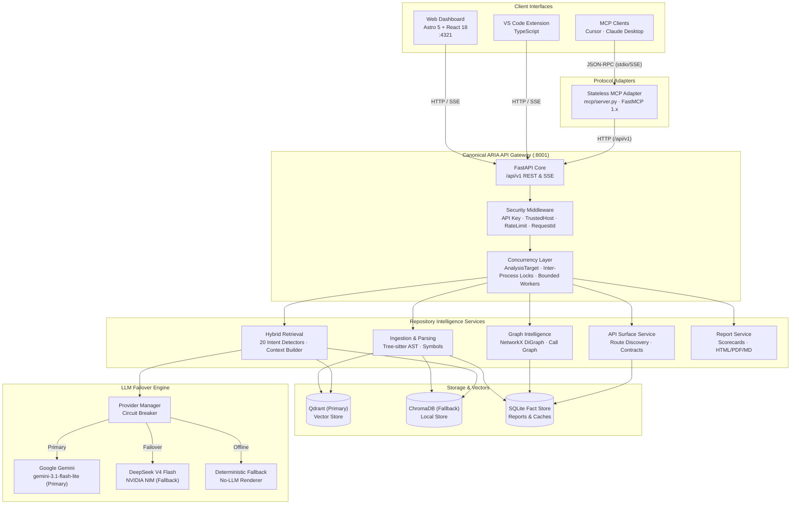

<div align="center">


<h1>ARIA</h1>

<h3>AI-Powered Repository Intelligence</h3>

<p>
Understand unfamiliar codebases before you change them.
</p>

<p>
Architecture · Execution · Contracts · Retrieval · Impact
</p>

[](https://github.com/VarshithReddy2006/ARIA/actions/workflows/ci.yml)
[](https://github.com/VarshithReddy2006/ARIA/stargazers)
[](https://github.com/VarshithReddy2006/ARIA/network/members)
[](https://github.com/VarshithReddy2006/ARIA/releases)


<br/>


<br/>

[Overview](#why-aria) · [Mental Model](#the-aria-mental-model) · [Capabilities](#what-aria-provides) · [Architecture](#architecture) · [Foundations](#engineering-foundations) · [Quick Start](#quick-start) · [API](#api-reference) · [MCP](#mcp) · [Performance](#performance--benchmarks) · [Deployment](#deployment) · [Roadmap](#roadmap) · [FAQ](#faq)

<br/>

</div>

---

## At a Glance

ARIA is an AI-powered repository intelligence platform built on the **Repository Intelligence Architecture (RIA)** — a modular, layered architecture designed for AI-native repository understanding. ARIA combines Abstract Syntax Tree (AST) parsing, directed dependency graphs, static call graphs, symbol indexing, API surface classification, vector retrieval, and conversational AI to help developers understand unfamiliar repositories before changing them.

ARIA introduces a stateless **Model Context Protocol (MCP)** adapter server over HTTP, enabling AI coding assistants such as Cursor, Claude Desktop, VS Code MCP clients, and MCP Inspector to interact directly with structured repository intelligence.

```text
Traditional RAG
Repository ──► Chunks ──► Embeddings ──► LLM (Structurally Blind)

─────────────────────────────────────────────────────────────────────────────

Repository Intelligence Architecture (RIA)
Repository ──► AST ──► File Graph ──► Call Graph ──► API Surface ──► Symbol Index ──► Qdrant ──► LLM
```

---

## Why ARIA?

### The Problem

Most codebase AI assistants run the same playbook: split source files into arbitrary text chunks, embed them into vectors, and retrieve snippets by cosine similarity. For prose, that works well. For code, **it is structurally blind.**

Code is not a collection of text fragments. It is a directed graph of modules, symbols, interfaces, and call sites. What matters — and what vector similarity cannot surface — is:

| Structural Dimension | What's Missing in Text-Only RAG |
|---|---|
| **Import topology** | Which modules depend on which, and in what direction |
| **Call hierarchies** | What a function transitively invokes across files |
| **Reachability** | Which files are actually reached from any entry point |
| **Coupling & Blast Radius** | Which files and tests will break if a given interface changes |
| **API Contracts** | Which routes/symbols are public vs internal vs uncalled |

```
Traditional RAG pipeline:

  Repository  ──►  chunk  ──►  embed  ──►  similarity search  ──►  LLM  ──►  answer
                                                  ▲
                                   ┌──────────────┴─────────────┐
                                   │   no import graph          │
                                   │   no call graph            │
                                   │   no symbol index          │
                                   │   no API surface contracts │
                                   │   no reachability traces   │
                                   │   no blast-radius estimate │
                                   └────────────────────────────┘
```

> [!CAUTION]
> The result: hallucinated import paths, missed transitive side effects, and zero blast-radius awareness. **Semantic similarity is not a substitute for structural knowledge.**

### The Solution

ARIA runs a **structural analysis pass before any retrieval**. The dependency graph, call graph, API surface classification, and symbol index are built first — directly from ASTs and Git history. Retrieval is grounded in that structure, not in raw text similarity.

```
Repository
 ├── Tree-sitter AST ──────────►  imports · exports · symbols · call sites · route handlers
 │                                               │
 │                                    NetworkX DiGraph & Graph Index
 │                                     ├── BFS reachability traces
 │                                     ├── centrality-ordered reading paths
 │                                     ├── call graph caller/callee trees
 │                                     ├── blast-radius propagation
 │                                     └── API contract exposure & breaking change analysis
 │
 ├── BGE-small-en-v1.5 ────────►  Qdrant Primary Vector Store (ChromaDB Fallback)
 └── Git history mining ───────►  churn scores · coupling · hotspot files
                                               │
                        Google Gemini 3.1 Flash Lite / DeepSeek V4 Flash
                                               │
                                   Structurally grounded answers
```

> [!IMPORTANT]
> Every LLM call receives retrieved chunks **plus** the structural context that makes those chunks meaningful: which modules import the file, which functions call the symbol, what contracts are exposed, and which downstream files are affected by a change.

### Comparison

Traditional RAG tools index text. ARIA indexes **your codebase's architecture, execution, and contracts.**

| Capability | Traditional RAG | ARIA |
|---|:---:|:---:|
| Semantic code search | Yes | **Yes (Qdrant + BGE-small)** |
| Dependency graph (import topology) | No | **Yes (NetworkX DiGraph)** |
| Call graph (function-level hierarchy) | No | **Yes (AST Caller/Callee)** |
| AST symbol index (classes, functions, methods) | No | **Yes (Tree-sitter)** |
| API surface & exposure classification | No | **Yes (Public / Internal / Routes)** |
| Breaking change & contract simulation | No | **Yes** |
| Reachability traces (BFS graph walks) | No | **Yes** |
| Dead code & orphan detection | No | **Yes (Cleanup Score 0–100)** |
| Architecture drift detection | No | **Yes (PR Delta-Patching)** |
| PR blast-radius scoring | No | **Yes (XS → XL, Low → Extreme)** |
| Churn × coupling hotspot analysis | No | **Yes (Git Churn Matrix)** |
| Incremental analysis (hash-based) | No | **Yes (< 2s on small diffs)** |
| Onboarding reading order | No | **Yes (Centrality-Ranked)** |
| Grounded Repository Chat | Partial | **Yes (20 Intent Detectors)** |
| Rule-based intent routing (zero LLM overhead) | No | **Yes** |
| Circuit-breaker LLM failover | No | **Yes (Gemini ➔ DeepSeek)** |
| Model Context Protocol (MCP) | No | **Yes (17 Tools via HTTP Adapter)** |
| IDE Integration (VS Code Extension) | No | **Yes (CodeLens, Hovers, Webviews)** |
| Prometheus observability | No | **Yes (/metrics)** |

---

## The Developer Questions ARIA Answers

Traditional developer tools often answer: *"Where is this code?"*

ARIA is built to answer the questions engineers ask when working in complex or unfamiliar codebases:

- **Architecture**: *"How is this repository organized, and where are the architectural boundaries?"*
- **Execution**: *"What happens when this function executes, and who calls it transitively?"*
- **Exposure**: *"What does this system expose to external consumers, and what is strictly internal?"*
- **Impact**: *"Who depends on this module, and what breaks if I modify this signature?"*
- **Failure Boundaries**: *"Where can this execution flow fail, and which callers handle the error?"*
- **Hygiene**: *"Is this code still reachable, or is it an orphaned dependency?"*
- **Onboarding**: *"What is the optimal reading sequence to understand this codebase quickly?"*

---

## The ARIA Mental Model

ARIA organizes repository intelligence across three primary dimensions:

```
┌─────────────────────────────────────────────────────────────────────────┐
│                        ARIA INTELLIGENCE MODELS                         │
├─────────────────────────┬─────────────────────────┬─────────────────────┤
│       FILE GRAPH        │       CALL GRAPH        │     API SURFACE     │
│   Architecture / Spatial│   Execution / Temporal  │  Contract / Exposure│
│                         │                         │                     │
│  "How is this           │  "What happens when     │  "What does this    │
│   repository            │   the software runs?"   │   system expose, who│
│   organized?"           │                         │   depends on it, and│
│                         │                         │   what happens if I │
│                         │                         │   change it?"       │
└─────────────────────────┴─────────────────────────┴─────────────────────┘
```

### File Graph — Architecture / Spatial
- **Question Answered**: *"How is this codebase structured, what are the module boundaries, and where are circular dependencies?"*
- **Mechanism**: Tree-sitter AST extraction builds a directed import graph. NetworkX calculates modularity clusters, in-degree/out-degree centralities, dependency cycles, and topological layers.

### Call Graph — Execution / Temporal
- **Question Answered**: *"What executes when a function is invoked, who calls it, and what is the blast radius of changing it?"*
- **Mechanism**: Static AST traversal maps function invocations across files, linking caller/callee hierarchies, tracing transitive execution chains, and identifying hotspot functions.

### API Surface — Contract / Exposure
- **Question Answered**: *"What endpoints and symbols does this system expose, who depends on them internally, and what happens if I alter a contract?"*
- **Mechanism**: Discovers HTTP route decorators (FastAPI, Express, Flask, etc.), public/internal exported symbols, detects uncalled routes, extracts schema contracts, and evaluates breaking change risk.

---

## What ARIA Provides

### Repository Analysis
- **End-to-End Pipeline**: Clones public or private GitHub repositories, runs AST parsing, vector embedding, graph construction, and metric scoring in one workflow.
- **Incremental Builds**: Detects changed files using SHA-256 content hashes. Only modified files are re-parsed, re-embedded, and re-indexed. Small change sets rebuild in **under 2 seconds**.
- **Tech Stack Detection**: Automatically identifies languages, frameworks, package managers, and configuration files before pipeline execution.

### Structural Code Intelligence
- **Symbol Indexing**: AST-extracted index of every class, function, method, and variable across the repository with file-slice metadata (`start_line`, `end_line`).
- **Definition & Reference Resolution**: Fast O(1) definition lookup and cross-file reference search without requiring external language server daemons.
- **Churn & Coupling Matrix**: Mines git commit history to calculate per-file churn rates, identifying hotspot files that combine high change frequency with heavy coupling.

### File Graph
- **Interactive Topology**: React Flow canvas with Dagre hierarchical layout, node search filtering, and neighborhood exploration.
- **Architecture Clustering**: Groups files into cohesive architectural domains based on import density.
- **Reachability Tracing**: Forward and backward BFS traces showing exact dependency paths from any file.

### Call Graph
- **Function-Level Execution**: Traces exact caller and callee trees across files.
- **Blast Radius Computation**: Calculates the percentage and list of downstream files and functions affected if a given function changes.
- **Critical Path Identification**: Highlights deeply nested or highly connected execution paths.

### API Surface Intelligence
- **Route & Interface Discovery**: Discovers HTTP routes (path, HTTP method, handler function) and public interface boundaries.
- **No-Internal-Caller Analysis**: Identifies public API routes and exports that have no internal callers within the repository.
- **Contract Inspection & Schemas**: Extracts request and response schema structures from signatures and models.
- **Change Impact Simulation**: Evaluates proposed modifications against API contracts, assigning evidence levels and risk scores.

### Retrieval
- **Hybrid Retrieval Architecture**: Blends semantic vector search with structural graph context.
- **Zero Per-Chunk Filesystem Reads**: Line slices and metadata are pre-indexed in memory.
- **Memoized Symbol Access**: Resolves symbols directly from in-memory lookup tables.
- **Active-Version Caching**: Normalized queries are cached against active snapshot versions.

### Repository Chat
- **20 Intent Enum Values (19 Specialized Domain Intents + UNKNOWN)**: Classifies questions across 20 intent enum values (19 specialized domain categories: `API_SURFACE`, `CALL_GRAPH`, `ARCHITECTURE`, `FILE_EXPLANATION`, `SYMBOL`, `SYMBOL_EXPLANATION`, `DEPENDENCY`, `CIRCULAR_DEPENDENCY`, `IMPACT_ANALYSIS`, `CHANGE_PLANNING`, `DEBUGGING`, `READING_ORDER`, `HEALTH`, `DEAD_CODE`, `SECURITY`, `GIT_HISTORY`, `PR_RISK`, `API_FLOW`, `GENERAL_QA`, plus `UNKNOWN`) with zero LLM overhead using deterministic regex and keyword matching.
- **Context Construction**: Assembles AST snippets, call paths, dependency chains, and retrieved code chunks within strict token budgets.
- **Streaming Responses**: Server-Sent Events (SSE) stream token deltas in real-time, concluding with verified file citations and confidence scores.

### Impact Analysis
- **Natural Language Impact Prediction**: Accepts a description of an intended change (e.g. *"Refactor auth middleware to JWT"*) and predicts impacted files, callers, and test suites.
- **Transitive Dependency Walks**: Propagates changes across import graphs and call hierarchies.

### Dead Code
- **Reachability Sweep**: Traverses the dependency graph from detected entry points to uncover orphaned files and unreachable functions.
- **Cleanup Score (0–100)**: Prioritizes remediation based on file size, isolation, and dead dependency chain depth.

### Git History / Churn
- **Commit History Mining**: Calculates change frequency, author ownership, and churn trends over time.
- **Hotspot Detection**: Correlates high churn with architectural centrality to identify maintenance risks.

### PR Intelligence
- **Risk Scoring**: Evaluates pull requests by size (XS → XL) and blast radius (LOW → EXTREME).
- **Architecture Drift Detection**: Delta-patches the dependency graph against changed files to detect newly introduced dependency cycles or architectural violations.

### Reading Path
- **Centrality-Ranked Onboarding**: Generates a step-by-step reading sequence based on graph centrality, guiding new engineers through entry points, core abstractions, and leaf modules.

### Health Reports
- **Multi-Axis Health Scorecard**: Scores repositories across Architecture Stability, API Quality, Code Hygiene, Hotspot Risk, and Onboarding Clarity.
- **Multi-Format Export**: Generates Interactive HTML, Print-Optimized PDF, and Markdown suitable for GitHub PR comments.

### Advisor
- **AI Engineering Advisor**: Analyzes architectural debt, circular imports, and dead code to produce prioritized, actionable engineering recommendations.

### Execution Planner
- **Phased Implementation Plans**: Converts refactoring recommendations into concrete, dependency-ordered task batches with rollback safety checkpoints.

### MCP
- **Model Context Protocol Server**: Exposes 17 repository intelligence tools to AI coding assistants (Claude Desktop, Cursor, VS Code MCP) via a stateless protocol adapter over HTTP.

### VS Code
- **ARIA VS Code Extension**: In-editor CodeLens (*"Show Callers"*, *"Show Blast Radius"*, *"Ask Agent"*), symbol hover cards, sidebar panels (Findings, Advisor, Execution Plan), and embedded interactive graph webviews.

---

## Architecture

### System Architecture



### Analysis Pipeline

ARIA processes repository structures through two complementary lenses:

#### Canonical 13-Phase Build Pipeline
1. **Target Acquisition**: Validates and checks out `AnalysisTarget` (`owner/repo@branch`).
2. **Tech Stack Detection**: Inspects manifest files, package configs, and language markers.
3. **AST Parsing**: Multi-language Tree-sitter parsing extracting classes, functions, and imports.
4. **Symbol Indexing**: Pre-indexes symbol names, signatures, and line boundary metadata.
5. **Dependency Graphing**: Constructs directed import topology with cycle detection.
6. **Call Graph Synthesis**: Maps static function invocations and caller/callee trees.
7. **API Surface Classification**: Discovers HTTP routes, public symbols, and uncalled endpoints.
8. **Token-Aware Chunking**: Slices files along syntax boundaries with line-range preservation.
9. **Vector Embedding**: Encodes chunk semantics via `bge-small-en-v1.5`.
10. **Vector Store Ingestion**: Stages and publishes indexed vectors atomically into Qdrant.
11. **Inspection & Dead Code**: Sweeps reachability from entry points and flags code smells.
12. **Git History Mining**: Extracts commit churn matrices and correlates hotspot files.
13. **Scorecard & Report Generation**: Compiles multi-axis metrics, snapshots, and export artifacts.

#### Simplified Conceptual Pipeline
```text
Clone ──► Parse ──► Embed ──► Index ──► Graph ──► Analyze ──► Reason ──► Deliver
```

### Client/API Boundary

All clients communicate exclusively through the canonical ARIA REST API (`/api/v1`):

```
Web Dashboard ──────┐
VS Code Extension ──┼──►  Canonical ARIA API (/api/v1)  ──►  Internal Services & Storage
MCP Protocol Adapter┘
```

- **Zero Direct Storage Access**: Clients and adapters never query Qdrant, SQLite, or internal files directly.
- **Consistent Security & Observability**: All operations traverse rate limiting, API key authentication, request tracing, and Prometheus metrics.

### MCP Boundary

The MCP integration operates as a stateless HTTP adapter:

```
┌────────────────────────┐
│  AI Coding Assistant   │ (Cursor / Claude Desktop / VS Code MCP)
└───────────┬────────────┘
            │ stdio / SSE (JSON-RPC 2.0)
┌───────────▼────────────┐
│   ARIA FastMCP Server  │ (mcp/server.py)
└───────────┬────────────┘
            │ HTTP /api/v1 (AriaAPIClient)
┌───────────▼────────────┐
│   Canonical ARIA API   │ (backend/api.py)
└────────────────────────┘
```

- **Decoupled Lifecycle**: The MCP server runs independently and can connect to a local or remote ARIA backend.
- **Error Normalization**: HTTP error codes (404, 429, 500) are mapped to standard JSON-RPC 2.0 tool errors with sanitized messages.

---

## Engineering Foundations

### Concurrency
- **Canonical `AnalysisTarget`**: Deterministic identity model (`owner/repo@branch`) prevents working tree collisions across threads and processes.
- **Inter-Process Locking**: Cross-process lockfiles (`interprocess_file_lock`) serialize concurrent analyses of the same repository/branch while allowing parallel analysis of different repositories.
- **Bounded Worker Pool**: Background analysis concurrency is capped by `ARIA_MAX_CONCURRENT_ANALYSES` (defaulting safely based on CPU cores).
- **Job Deduplication**: Redundant analysis requests for in-flight repositories automatically attach to the running task without spawning duplicate jobs.

### Repository Isolation
- **Sandboxed Clones**: Target repositories are cloned into isolated directories with strict path validation preventing directory traversal.
- **Clean State Routines**: Switching repositories cleans active graph memory and cache entries.

### Retrieval Performance
- **Pre-Indexed Line Slices**: Chunk boundaries (`start_line`, `end_line`) are stored during indexing, eliminating per-chunk disk reads during retrieval.
- **O(1) Symbol Lookups**: File symbols and symbol definitions resolve from in-memory hash maps.
- **Parallel Fan-Out**: Vector search and graph traversals execute concurrently during retrieval assembly.

### Caching
- **Schema-Versioned In-Memory Cache**: Stores parsed ASTs, graph nodes, and metrics with automatic invalidation on schema changes.
- **Active-Version Query Cache**: Normalized user queries are cached against the active repository snapshot hash.

### LLM Failover
- **Dual-Provider Architecture**: Google Gemini (`gemini-3.1-flash-lite`) serves as primary; DeepSeek (`deepseek-ai/deepseek-v4-flash-0731` via NVIDIA NIM) serves as fallback.
- **Circuit Breaker**: Tracks consecutive errors (threshold: 3) and opens a 60-second cooldown window, routing traffic to DeepSeek.
- **Deterministic Error Classification**: Categorizes provider exceptions into actionable types (`MISSING_CREDENTIALS`, `AUTHENTICATION_ERROR`, `RATE_LIMIT_ERROR`, `TIMEOUT_ERROR`, `SERVER_ERROR`).
- **No-LLM Fallback Renderer**: If all external providers are unavailable, ARIA renders structured responses directly from graph facts.

### Reliability
- **Fail-Fast Startup**: In `APP_ENV=production`, missing API keys or invalid host configurations halt startup with actionable logs.
- **Safe Exception Handlers**: Internal stack traces and secrets are stripped from API responses.

### Observability
- **Prometheus Metrics**: Exposes HTTP request counts, active request gauges, build duration histograms, and cache hit/miss counters at `/metrics`.
- **Structured JSON Logging**: Request IDs (`X-Request-ID`) trace every request across middleware and background workers.

### Security
- **API Key Enforcement**: `APIKeyMiddleware` validates incoming keys against `API_KEY`.
- **Host Validation**: `HealthExemptTrustedHostMiddleware` enforces `ALLOWED_HOSTS` while exempting `/health` and `/ready` probes.
- **Rate Limiting**: Sliding-window limiter restricts request rates per IP.

---

## Technology Stack

| Layer | Technology | Purpose |
|---|---|---|
| **Backend Framework** | Python 3.11+ / FastAPI | Asynchronous REST gateway, middleware, and Server-Sent Events |
| **AST Parsing** | Tree-sitter (Python, JS, TS) | Multi-language syntactic analysis and symbol extraction |
| **Graph Engine** | NetworkX 3.x | Directed dependency graphs, BFS reachability, cycle detection |
| **Primary Vector Store** | Qdrant (Cloud / Local) | High-dimensional embedding storage and similarity search |
| **Fallback Vector Store**| ChromaDB | Zero-dependency local development vector store |
| **Embedding Model** | `BAAI/bge-small-en-v1.5` | Dense code representation embeddings |
| **Primary LLM** | Google Gemini (`gemini-3.1-flash-lite`) | Code reasoning, chat synthesis, and impact analysis |
| **Fallback LLM** | DeepSeek (`deepseek-ai/deepseek-v4-flash-0731`) | Failover reasoning via NVIDIA NIM |
| **Frontend Framework** | Astro 5 + React 18 + TypeScript | Server-rendered pages with interactive client islands |
| **Graph UI** | React Flow 11 + Dagre | Interactive graph rendering with automatic DAG layouts |
| **Styling** | Tailwind CSS 3 + Lucide React | Developer UI with dark-mode first design |
| **Protocol Integration**| Model Context Protocol (FastMCP 1.x) | Standardized tool server for AI assistants |
| **IDE Extension** | VS Code Extension API | CodeLens, symbol hover cards, and sidebar views |
| **Observability** | Prometheus Client | Metrics scraping target at `/metrics` |
| **Containers** | Docker & Docker Compose | Multi-stage production and development containerization |

---

## Repository Structure

```
ARIA/
├── backend/                      # FastAPI application & entry points
│   ├── api.py                    # App factory, middleware stack, router mounting
│   ├── dependencies.py           # Service singletons & dependency injection
│   ├── security_middleware.py    # RateLimit, APIKey, TrustedHost middlewares
│   ├── logging_middleware.py     # Request ID logging middleware
│   ├── metrics_middleware.py     # Prometheus HTTP metrics collector
│   ├── exception_handlers.py     # Global sanitized exception handlers
│   └── routers/                  # Endpoint handlers grouped by domain
│       ├── health.py             # /health, /ready endpoints
│       ├── repositories.py       # /api/v1/analyze, /repositories endpoints
│       ├── chat.py               # /api/v1/chat, /stream, /graph-rag endpoints
│       ├── architecture.py       # /api/v1/architecture endpoints
│       ├── graph.py              # /api/v1/graph endpoints
│       ├── call_graph.py         # /api/v1/call-graph endpoints
│       ├── api_surface.py        # /api/v1/api-surface endpoints
│       ├── symbols.py            # /api/v1/symbols endpoints
│       ├── report.py             # /api/v1/report endpoints
│       ├── workspace.py          # /api/v1/workspace endpoints
│       ├── advisor.py            # /api/v1/advisor endpoints
│       ├── execution.py          # /api/v1/execution endpoints
│       ├── pr.py                 # /api/v1/pr endpoints
│       └── git_history.py        # /api/v1/git-history endpoints
│
├── core/                         # Core models, configuration & concurrency
│   ├── config.py                 # Pydantic Settings (.env configuration)
│   ├── concurrency.py            # Cross-process file locking & atomic writes
│   ├── repository_target.py      # Canonical AnalysisTarget identity model
│   ├── cache.py                  # Schema-versioned in-memory cache
│   └── build_pipeline.py         # DAG task orchestration
│
├── services/                     # Business logic & intelligence engines
│   ├── chat/                     # Grounded chat, intent detection, retrieval
│   │   ├── intent_detector.py    # 20 rule-based intent detectors
│   │   ├── intent_router.py      # Routes intents to domain services
│   │   ├── retrieval.py          # Pre-indexed chunk retrieval & reranking
│   │   ├── retrieval_pipeline.py # Authoritative retrieval orchestrator
│   │   ├── context_builder.py    # Token budget management
│   │   └── provider_manager.py   # Circuit breaker & provider failover
│   ├── llm/                      # Gemini & DeepSeek provider integrations
│   ├── symbol_service.py         # Symbol definition and reference indexing
│   ├── tree_sitter_service.py    # AST extraction
│   ├── call_graph_service.py     # Static call graph synthesis
│   ├── api_surface_service.py    # Route discovery & contract classification
│   └── report/                   # Health scorecards & export renderers
│
├── memory/                       # Vector store abstractions
│   ├── vector_store.py           # Production VectorStore interface & router
│   ├── qdrant_store.py           # Qdrant client implementation
│   └── chroma_store.py           # ChromaDB fallback client
│
├── mcp/                          # Model Context Protocol adapter layer
│   ├── server.py                 # FastMCP server registration
│   ├── aria_client.py            # HTTP client to canonical ARIA API
│   ├── resources/                # 5 MCP resource providers
│   └── tools/                    # 17 registered MCP tools
│
├── frontend/                     # Web Dashboard (Astro 5 + React 18)
│   ├── src/pages/                # Astro page routes
│   ├── src/components/           # Interactive React components & graph canvases
│   ├── public/favicon.svg        # Official brand icon
│   └── package.json              # Frontend dependencies
│
├── vscode-extension/             # ARIA VS Code Extension (TypeScript)
│   ├── src/                      # Extension commands, CodeLens, webviews
│   └── package.json              # Extension manifests and commands
│
├── infrastructure/               # Job execution & system adapters
├── storage/                      # SQLite migrations & snapshot stores
├── tests/                        # Backend test suites (unit, integration, arch)
├── docs/                         # Extended documentation
├── Dockerfile.api                # Production API container
├── Dockerfile.worker             # Production background worker container
└── docker-compose.prod.yml       # Production multi-container compose
```

---

## Quick Start

### Prerequisites

| Requirement | Version / Notes |
|---|---|
| **Python** | `3.11` or `3.12` |
| **Node.js** | `>= 20.0.0` |
| **Git** | Any recent version available in PATH |
| **LLM Key** | Google Gemini (`GEMINI_API_KEY`) or DeepSeek (`DEEPSEEK_API_KEY`) |
| **Disk Space** | ~2 GB (local BGE model cache on first run) |

---

### Step 1: Clone & Configure

```bash
git clone https://github.com/VarshithReddy2006/ARIA.git
cd ARIA

cp .env.example .env
```

Edit `.env` with your API keys:

```ini
APP_ENV=development
API_SERVER_PORT=8001
API_KEY=local-dev-key

# LLM Providers
LLM_PROVIDER=gemini
GEMINI_API_KEY=your-gemini-api-key
GEMINI_MODEL=gemini-3.1-flash-lite

# Fallback LLM (Optional)
DEEPSEEK_API_KEY=your-deepseek-api-key

# Vector Store
VECTOR_STORE_BACKEND=qdrant
QDRANT_URL=http://127.0.0.1:6333
VECTOR_STORE_ENABLE_FALLBACK=true
```

---

### Step 2: Run Backend

```bash
# Set up Python virtual environment
python -m venv .venv
source .venv/bin/activate  # Windows: .venv\Scripts\activate

# Install dependencies
pip install -r requirements.txt

# Start API server
uvicorn backend.api:app --host 0.0.0.0 --port 8001 --reload
```

---

### Step 3: Run Frontend

```bash
cd frontend
npm install
npm run dev
```

Visit **`http://localhost:4321`** in your browser.

---

### Step 4: Run MCP Server

```bash
# Start MCP stdio server
python -m mcp.server
```

Connect directly from Cursor, Claude Desktop, or VS Code MCP.

---

## Usage

### Analyze a Repository

```bash
# Via CLI
repo-intel analyze https://github.com/fastapi/fastapi

# Via REST API (streams Server-Sent Events progress)
curl -N -X POST http://localhost:8001/api/v1/analyze \
  -H "Content-Type: application/json" \
  -d '{"url": "https://github.com/fastapi/fastapi", "branch": "master"}'
```

### Chat with a Repository

```bash
curl -N -X POST http://localhost:8001/api/v1/chat \
  -H "Content-Type: application/json" \
  -d '{
    "repo": "fastapi/fastapi",
    "message": "How is dependency injection implemented?",
    "history": []
  }'
```

### Inspect API Surface

```bash
curl http://localhost:8001/api/v1/api-surface/fastapi/fastapi
```

### Generate an Intelligence Report

```bash
# Build report
curl -X POST http://localhost:8001/api/v1/report/fastapi/fastapi/build

# Download as HTML or Markdown
curl -o report.html "http://localhost:8001/api/v1/report/fastapi/fastapi/download?format=html"
curl -o report.md   "http://localhost:8001/api/v1/report/fastapi/fastapi/download?format=markdown"
```

### PR Risk Analysis

```bash
curl -X POST http://localhost:8001/api/v1/pr/analyze \
  -H "Content-Type: application/json" \
  -d '{"owner": "fastapi", "repo": "fastapi", "pr_number": 1234}'
```

---

## Configuration

All configuration is managed via environment variables and validated through Pydantic Settings in `core/config.py`.

### Required Settings

| Variable | Default | Description |
|---|---|---|
| `LLM_PROVIDER` | `gemini` | Primary provider: `gemini` or `deepseek` |
| `GEMINI_API_KEY` | — | Google AI Studio key (required when `LLM_PROVIDER=gemini`) |
| `DEEPSEEK_API_KEY` | — | NVIDIA NIM key (required when `LLM_PROVIDER=deepseek`) |

### Optional Settings

<details>
<summary><strong>View all optional configuration parameters</strong></summary>

<br/>

| Variable | Default | Description |
|---|---|---|
| `APP_ENV` | `development` | `development`, `test`, or `production` (enforces strict startup validation) |
| `API_SERVER_HOST` | `0.0.0.0` | Uvicorn bind host |
| `API_SERVER_PORT` | `8001` | Uvicorn bind port |
| `API_KEY` | — | API key required for secured endpoints |
| `ALLOWED_HOSTS` | `["*"]` | TrustedHost allowed hostnames (wildcard prohibited in production) |
| `RATE_LIMIT_PER_MINUTE`| `60` | Max requests per IP per minute |
| `GEMINI_MODEL` | `gemini-3.1-flash-lite` | Gemini model variant |
| `GEMINI_FALLBACK_MODELS`| `gemini-3.5-flash,gemini-3-flash-preview,gemini-flash-lite-latest,gemini-2.5-flash` | Comma-separated Gemini fallbacks |
| `DEEPSEEK_BASE_URL` | `https://integrate.api.nvidia.com/v1` | NVIDIA NIM endpoint |
| `DEEPSEEK_MODEL` | `deepseek-ai/deepseek-v4-flash-0731` | DeepSeek model variant |
| `VECTOR_STORE_BACKEND` | `qdrant` | Vector store backend (`qdrant` or `chroma`) |
| `VECTOR_STORE_ENABLE_FALLBACK`| `true` | Fallback to ChromaDB if Qdrant is unreachable |
| `QDRANT_URL` | `http://127.0.0.1:6333` | Qdrant HTTP/REST URL |
| `QDRANT_API_KEY` | — | API key for Qdrant Cloud cluster |
| `QDRANT_PREFER_GRPC` | `true` | Prefer gRPC transport for high-throughput vector queries |
| `EMBEDDING_MODEL` | `BAAI/bge-small-en-v1.5` | Dense embedding model |
| `ARIA_MAX_CONCURRENT_ANALYSES`| `min(4, max(2, cpus // 2))` | Maximum concurrent background repository analysis tasks |
| `FRONTEND_URL` | `http://localhost:4321` | Allowed CORS origin |
| `LOG_FORMAT` | `human` | `human` or `json` (use `json` in production) |
| `LOG_LEVEL` | `INFO` | Logging verbosity (`DEBUG`, `INFO`, `WARNING`, `ERROR`) |

</details>

---

## API Reference

The canonical API is versioned under `/api/v1`. Full schema documentation is available in [API.md](API.md).

| Domain | Method | Path | Description |
|---|---|---|---|
| **System** | `GET` | `/health` | Liveness health check |
| | `GET` | `/ready` | Readiness check (validates database & vector store) |
| | `GET` | `/metrics` | Prometheus metrics scrape target |
| **Analysis** | `POST` | `/api/v1/analyze` | Trigger background repository analysis (SSE stream) |
| | `GET` | `/api/v1/analyze/{job_id}` | Check status and progress of an analysis job |
| | `GET` | `/api/v1/analysis/{owner}/{repo}` | Fetch completed analysis result payload |
| | `GET` | `/api/v1/repos/recent` | List recently indexed repositories |
| | `GET` | `/api/v1/repos/examples` | List pre-configured example repositories |
| **Chat & Retrieval** | `POST` | `/api/v1/chat` | Submit repository query with intent classification & streaming |
| | `POST` | `/api/v1/retrieve` | Vector search with structural context retrieval |
| | `GET` | `/api/v1/chat/health` | Live LLM provider health diagnostic |
| | `POST` | `/api/v1/chat/reload` | Hot-reload LLM provider configuration |
| | `POST` | `/api/v1/issues/map` | Map GitHub issue to implementation plan |
| **Graphs** | `POST` | `/api/v1/architecture/build` | Build and index dependency graph |
| | `GET` | `/api/v1/architecture/{owner}/{repo}/graph` | React Flow architecture graph payload |
| | `GET` | `/api/v1/graph/{owner}/{repo}/full` | Full file-level dependency graph |
| | `GET` | `/api/v1/graph/{owner}/{repo}/neighbors/{node_path}` | Neighborhood nodes and edges for a file |
| | `GET` | `/api/v1/graph/{owner}/{repo}/trace/{node_path}` | BFS reachability trace from a node |
| | `POST` | `/api/v1/call-graph/build` | Build function-level call graph |
| | `GET` | `/api/v1/call-graph/{owner}/{repo}` | React Flow call graph payload |
| | `GET` | `/api/v1/call-graph/{owner}/{repo}/callers/{function_id}` | Callers of a function |
| | `GET` | `/api/v1/call-graph/{owner}/{repo}/callees/{function_id}` | Callees of a function |
| | `GET` | `/api/v1/call-graph/{owner}/{repo}/blast-radius/{function_id}` | Downstream blast radius computation |
| | `GET` | `/api/v1/call-graph/{owner}/{repo}/hierarchy/{function_id}` | Call hierarchy tree for a function |
| **API Surface** | `POST` | `/api/v1/api-surface/build` | Build API surface index |
| | `GET` | `/api/v1/api-surface/{owner}/{repo}` | Full API surface classification report |
| | `GET` | `/api/v1/api-surface/{owner}/{repo}/public` | Public API symbols and routes |
| | `GET` | `/api/v1/api-surface/{owner}/{repo}/breaking` | Breaking change detection across revisions |
| | `GET` | `/api/v1/api-surface/{owner}/{repo}/deprecated` | Deprecated symbols and interfaces |
| **Symbols** | `GET` | `/api/v1/symbols/{owner}/{repo}/file/{file_path}` | AST symbols extracted for a given file |
| | `GET` | `/api/v1/symbols/{owner}/{repo}/definition/{symbol_name}` | Look up definition site for a symbol |
| | `GET` | `/api/v1/symbols/{owner}/{repo}/references/{symbol_name}` | Cross-file references to a symbol |
| **Hygiene & Risk** | `POST` | `/api/v1/dead-code/analyze` | Sweep for dead files and uncalled functions |
| | `POST` | `/api/v1/pr/analyze` | PR risk classification (XS → XL) and blast radius |
| | `POST` | `/api/v1/architecture/drift` | Architecture drift delta-patching |
| | `POST` | `/api/v1/churn/analyze` | Mine git commit history for churn metrics |
| | `GET` | `/api/v1/churn/{owner}/{repo}/hotspots` | Top hotspot files (high churn × high coupling) |
| | `GET` | `/api/v1/churn/{owner}/{repo}/timeline` | Weekly commit activity timeline |
| **Workspace & Plan** | `GET` | `/api/v1/repositories/{username}/{repo}/workspace` | Consolidated IDE workspace snapshot |
| | `GET` | `/api/v1/repositories/{username}/{repo}/workspace/overview` | Overview metrics and health summary |
| | `GET` | `/api/v1/repositories/{username}/{repo}/workspace/findings` | Engineering findings panel data |
| | `GET` | `/api/v1/repositories/{username}/{repo}/workspace/advisor` | AI Advisor recommendations panel |
| | `GET` | `/api/v1/repositories/{username}/{repo}/workspace/execution` | Execution plan task batches panel |
| | `POST` | `/api/v1/repositories/{username}/{repo}/advisor` | Compile AI Advisor recommendations |
| | `GET` | `/api/v1/repositories/{username}/{repo}/advisor/recommendations` | List Advisor recommendations |
| | `GET` | `/api/v1/repositories/{username}/{repo}/advisor/roadmap` | Phased engineering refactoring roadmap |
| | `POST` | `/api/v1/repositories/{username}/{repo}/execution-plan` | Formulate autonomous execution plan |
| | `GET` | `/api/v1/repositories/{username}/{repo}/execution-plan/batches` | Planned execution task batches |
| | `GET` | `/api/v1/repositories/{username}/{repo}/execution-plan/critical-path` | Critical path of tasks |
| **Reports** | `POST` | `/api/v1/report/{owner}/{repo}/build` | Generate multi-axis health report |
| | `GET` | `/api/v1/report/{owner}/{repo}/summary` | Summarized health scores and grade |
| | `GET` | `/api/v1/report/{owner}/{repo}/download` | Download report (HTML, PDF, Markdown) |

---

## Model Context Protocol (MCP)

ARIA exposes a stateless MCP adapter server compliant with the Model Context Protocol specification.

### Architecture & Protocol Boundary

The MCP integration cleanly separates the assistant transport layer from the repository backend:

1. **Client Transport Layer (stdio / SSE)**:
   AI assistants (such as Cursor, Claude Desktop, VS Code MCP clients, and MCP Inspector) connect to the ARIA FastMCP server (`mcp/server.py`) using standard **stdio** or **Server-Sent Events (SSE)** JSON-RPC 2.0 transports.
2. **Backend API Boundary (HTTP REST)**:
   The FastMCP server operates as a strictly **stateless protocol adapter**. Rather than holding direct database connections or internal service singletons, it delegates all tool and resource operations over **HTTP** via `AriaAPIClient` directly to the canonical ARIA API (`/api/v1`).

```
┌────────────────────────┐
│   Claude / Cursor      │
│   (MCP Client)         │
└───────────┬────────────┘
            │ stdio / SSE (JSON-RPC 2.0)
┌───────────▼────────────┐
│   ARIA FastMCP Server  │
│   (mcp/server.py)      │
└───────────┬────────────┘
            │ HTTP (AriaAPIClient)
┌───────────▼────────────┐
│   ARIA REST API        │
│   (/api/v1)            │
└────────────────────────┘
```

### Available MCP Tools (17 Tools)

- **Repository & Workspace**: `list_repositories`, `get_repository_summary`, `analyze_repository`, `get_workspace`
- **Search & Retrieval**: `query_codebase`, `semantic_search`
- **Symbols**: `get_file_symbols`, `get_symbol_definition`, `get_symbol_references`
- **Architecture & Calls**: `get_dependency_graph`, `get_call_graph`, `get_architecture_summary`
- **Analysis & Contracts**: `get_api_surface`, `get_impact_analysis`, `get_dead_code`
- **Reports**: `generate_report`, `export_report`

### Available MCP Resources (5 Resource Templates)

- `repositories://list` — List of all indexed repositories.
- `repository://{owner}/{repo}/metadata` — Repository analysis metadata (tech stack, dependencies).
- `repository://{owner}/{repo}/architecture` — Component relationships and reading order.
- `repository://{owner}/{repo}/call-graph` — Function call hierarchy.
- `repository://{owner}/{repo}/symbols` — All indexed symbols across the repository.

### Claude Desktop Configuration

Add the following to your `claude_desktop_config.json`:

```json
{
  "mcpServers": {
    "aria": {
      "command": "python",
      "args": ["-m", "mcp.server"],
      "env": {
        "ARIA_API_URL": "http://127.0.0.1:8001",
        "ARIA_API_KEY": "your-api-key"
      }
    }
  }
}
```

---

## Performance & Benchmarks

> [!NOTE]
> Benchmark results are environment-dependent (measured on AMD / Intel multi-core developer workstation with local NVMe/SSD storage) and are not universal production SLAs. Production latency depends on repository size, storage throughput, network bandwidth, and upstream LLM provider responsiveness.

### Retrieval Microbenchmarks (Isolated In-Memory & Non-LLM Execution)

Microbenchmarks measure isolated in-memory retrieval, graph traversal, and symbol lookup execution times on pre-indexed repository snapshots without LLM generation overhead:

| Query Category | Deterministic Path (p50) | Non-LLM Retrieval (p50) | Description |
|---|---|---|---|
| **Exact File Query** | 0.01 ms | 1.05 ms | In-memory line slice and file metadata lookup |
| **Symbol Definition Query** | 0.80 ms | 11.42 ms | O(1) symbol index hash map resolution |
| **Architecture / Graph Query**| — | 9.02 ms | NetworkX dependency traversal and cluster resolution |
| **Semantic Code Query** | — | 5.77 ms | Vector similarity search in Qdrant (local/in-memory) |
| **General Codebase QA** | — | 6.06 ms | Hybrid graph + vector context assembly |

### Concurrent End-to-End Load Benchmarks (HTTP Multi-Client In-Flight Workload)

Concurrent load benchmarks evaluate end-to-end API throughput and latency under concurrent HTTP client workloads:

| Concurrent Clients | Success Rate | Throughput (req/s) | p50 Latency | p95 Latency | Errors |
|:---:|:---:|:---:|:---:|:---:|:---:|
| **1** | 100% | ~83 req/s | 1.2 ms | 3.1 ms | 0 |
| **10** | 100% | ~220 req/s | 2.8 ms | 6.4 ms | 0 |
| **25** | 100% | ~390 req/s | 5.1 ms | 12.8 ms | 0 |
| **50** | 100% | ~471 req/s | 96.6 ms | 113.5 ms | 0 |
| **100** | 100% | ~465 req/s | 142.0 ms | 185.0 ms | 0 |

### Pipeline Timings

- **Fresh Ingestion (~300 files)**: 25–40 seconds (AST parsing, graph building, BGE embeddings, and Qdrant indexing).
- **Incremental Rebuild (small diff)**: **< 2 seconds** (SHA-256 hash-based change detection skips unmodified files).

---

## Deployment

### Current Status

- **Qdrant Vector Store**: Active support for Qdrant Cloud Free cluster and local Docker Qdrant.
- **Local Docker Containers**: Verified production images via `Dockerfile.api` and `Dockerfile.worker`.
- **Hugging Face Cloud Deployment**: Community Hardware Grant application currently pursued for public hosted demo.
- **Hosted ARIA Demo**: Hosted cloud demonstration environment coming soon.

### Previous Azure Deployment (Historical)

Azure Container Apps was previously utilized for production validation and live demo hosting. It has been retired due to student subscription limits and replaced by the containerized Docker workflow. Self-hosting via Docker is the authoritative deployment path.

### Product Walkthrough

<p align="center">
  <a href="https://www.youtube.com/watch?v=evpdcO4QxzI">
    
  </a>
</p>

<p align="center">
<strong>Click the image to watch the full walkthrough on YouTube</strong>
</p>

---

## Self-Hosting

### Production Docker Compose

Run the production API, worker, and frontend services in containers:

```bash
docker compose -f docker-compose.prod.yml up -d --build
```

### Verifying Container Health

```bash
curl http://localhost:8001/health
# {"backend": "online", "llm_provider": "gemini", "status": "healthy"}

curl http://localhost:8001/ready
# {"status": "ready", "database": "connected", "vector_store": "ready"}
```

---

## Testing & Validation

ARIA maintains extensive automated test suites across all subsystems:

```bash
# Run backend test suite
pytest tests/ -v

# Run frontend test suite
cd frontend && npm test
```

### Test Suite Breakdown

- **Backend & Services**: 114+ test modules covering AST parsing, graph algorithms, concurrency locking, retrieval pipelines, provider failover, and security middlewares.
- **Frontend**: 23 test suites validating scene layouts, dagre framing, graph deep-linking, chat intelligence, and API surface interfaces.
- **MCP Adapter**: FastMCP parity, JSON-RPC 2.0 protocol conformance, transport safety, and HTTP API boundary suites.
- **VS Code Extension**: 12 test suites verifying command registration, webview message routing, CodeLens triggers, and mock backend integration.
- **Total**: Multi-layer automated regression validation covering all functional surfaces.

---

## Limitations

- **Static Call Resolution**: Call graphs are generated via static AST analysis; dynamic runtime dispatch, `eval()`, and runtime reflection cannot be fully resolved.
- **Internal vs External Consumers**: API surface intelligence evaluates callers within the repository; it cannot detect callers in closed third-party private codebases without external telemetry.
- **Memory Scaling on Huge Repositories**: Codebases exceeding 500,000 lines of code require proportional memory allocations for in-memory graph topologies and embeddings.
- **LLM Provider Quotas**: Chat synthesis quality and throughput depend on upstream API rate limits and quotas.

---

## Roadmap

### Completed (v1.5.0)
- [x] Repository Intelligence Architecture (RIA) layered system design.
- [x] Qdrant primary vector store integration with dual-write versioning.
- [x] Stateless FastMCP adapter over canonical HTTP API.
- [x] Interactive API Surface Analyzer and Call Graph UI.
- [x] Grounded Repository Chat with 20 deterministic intent types.
- [x] Resilient LLM failover engine (Gemini 3.1 Flash Lite ➔ DeepSeek V4 Flash).
- [x] Canonical `AnalysisTarget` concurrency and inter-process locking.
- [x] VS Code Extension (CodeLens, symbol hovers, webviews).

### In Progress
- [ ] Hosted public cloud demonstration deployment.
- [ ] Enhanced TypeScript/JSX type-directed call resolution.
- [ ] Autonomous repository drift monitoring agents.

### Planned
- [ ] Multi-repository cross-service dependency graphs.
- [ ] GitHub App integration for automated PR review comments.
- [ ] Custom Tree-sitter query plugin architecture.

---

## Contributing

Contributions are welcome! Please review [CONTRIBUTING.md](CONTRIBUTING.md) for guidelines on code style, testing, and pull requests.

```bash
pip install -e ".[dev]"
ruff check .
pytest tests/ -v
cd frontend && npm test
```

---

## FAQ

<details>
<summary><strong>Which programming languages are supported?</strong></summary>

Python, JavaScript, and TypeScript are supported via Tree-sitter AST parsers. Adding support for additional languages involves implementing a Tree-sitter grammar visitor.

</details>

<details>
<summary><strong>Can ARIA analyze private repositories?</strong></summary>

Yes. For private GitHub repositories, supply a personal access token via the `GITHUB_TOKEN` environment variable.

</details>

<details>
<summary><strong>Does ARIA require a GPU?</strong></summary>

No. The embedding model (`BAAI/bge-small-en-v1.5`) runs efficiently on CPU across Linux, macOS, and Windows.

</details>

<details>
<summary><strong>Does it work on Windows?</strong></summary>

Yes. ARIA is fully tested and supported on Windows (PowerShell/CMD), macOS, Linux, and WSL2.

</details>

<details>
<summary><strong>Can it run without external internet access?</strong></summary>

AST parsing, graph generation, dead code detection, and vector embeddings run completely offline. An internet connection is only needed for cloning remote repositories and communicating with external LLM APIs (Gemini/DeepSeek). When offline, ARIA's fallback renderer provides structured facts without an LLM.

</details>

<details>
<summary><strong>How does MCP connect to ARIA?</strong></summary>

The MCP server is a stateless protocol adapter (`mcp/server.py`). It receives JSON-RPC 2.0 requests from Cursor or Claude Desktop and forwards them via HTTP to ARIA's canonical REST API (`/api/v1`).

</details>

<details>
<summary><strong>What is the difference between Qdrant and ChromaDB in ARIA?</strong></summary>

Qdrant is the primary production vector database, supporting both local instances and Qdrant Cloud. ChromaDB is maintained as an automatic fallback for zero-configuration local development.

</details>

---

## Troubleshooting

<details>
<summary><strong>Backend fails to start in production mode (APP_ENV=production)</strong></summary>

In production mode, ARIA validates that `API_KEY` is set and `ALLOWED_HOSTS` contains explicit domains (wildcard `*` is prohibited). Set these in `.env` or container environment variables.

</details>

<details>
<summary><strong>Uvicorn reload loop when cloning repositories</strong></summary>

Ensure `CLONED_REPOS_PATH` points to a path outside the backend directory tree (e.g. `data/cloned_repos` or `~/.repo_intelligence/cloned_repos`) so file changes do not trigger the auto-reloader.

</details>

<details>
<summary><strong>pytest fails with import errors from data directory</strong></summary>

Always run `pytest tests/ -v` with the explicit `tests/` directory to prevent pytest from traversing cloned repositories in `data/`.

</details>

---

## Documentation

- [Architecture Guide](ARCHITECTURE.md)
- [API Reference](API.md)
- [Installation Guide](INSTALLATION.md)
- [Contributing Guidelines](CONTRIBUTING.md)
- [Security Policy](SECURITY.md)
- [Roadmap](ROADMAP.md)
- [Frequently Asked Questions](FAQ.md)
- [Troubleshooting](TROUBLESHOOTING.md)

---

## License

Distributed under the MIT License. See [LICENSE](LICENSE) for details.

---

## Acknowledgements

Built on top of excellent open-source foundations:

[FastAPI](https://fastapi.tiangolo.com/) ·
[Astro](https://astro.build/) ·
[React Flow](https://reactflow.dev/) ·
[Qdrant](https://qdrant.tech/) ·
[Tree-sitter](https://tree-sitter.github.io/tree-sitter/) ·
[NetworkX](https://networkx.org/) ·
[sentence-transformers](https://www.sbert.net/) ·
[Google Gemini](https://ai.google.dev/) ·
[NVIDIA NIM](https://www.nvidia.com/en-us/ai/) ·
[Model Context Protocol](https://modelcontextprotocol.io/) ·
[FastMCP](https://github.com/jlowin/fastmcp)
