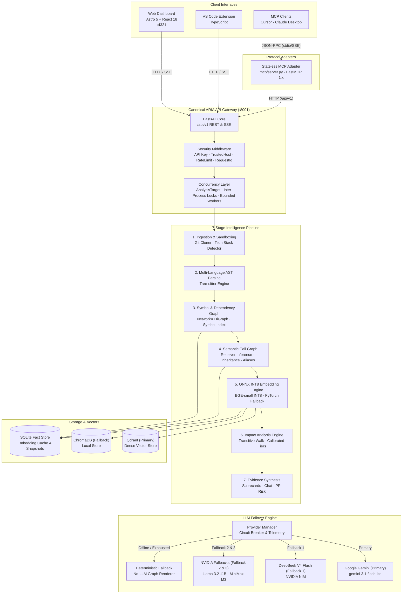

<div align="center">


<h1>ARIA</h1>

<h3>AI-Powered Repository Intelligence</h3>

<p>
Understand unfamiliar codebases before you change them.
</p>

<p>
Architecture · Execution · Contracts · Retrieval · Impact
</p>

[](https://github.com/VarshithReddy2006/ARIA/actions/workflows/ci.yml)
[](https://github.com/VarshithReddy2006/ARIA/stargazers)
[](https://github.com/VarshithReddy2006/ARIA/network/members)
[](https://github.com/VarshithReddy2006/ARIA/releases)


<br/>


<br/>

[Overview](#why-aria) · [Mental Model](#the-aria-mental-model) · [Capabilities](#what-aria-provides) · [Architecture](#architecture) · [Foundations](#engineering-foundations) · [Quick Start](#quick-start) · [API](#api-reference) · [MCP](#mcp) · [Performance](#performance--benchmarks) · [Deployment](#deployment) · [Roadmap](#roadmap) · [FAQ](#faq)

<br/>

</div>

---

## At a Glance

ARIA is an AI-powered repository intelligence platform built on the **Repository Intelligence Architecture (RIA)** — a modular, layered architecture designed for AI-native repository understanding. ARIA combines Abstract Syntax Tree (AST) parsing, directed dependency graphs, semantic call graphs, symbol indexing, API surface classification, vector retrieval, and conversational AI to help developers understand unfamiliar repositories before changing them.

ARIA introduces a stateless **Model Context Protocol (MCP)** adapter server over HTTP, enabling AI coding assistants such as Cursor, Claude Desktop, VS Code MCP clients, and MCP Inspector to interact directly with structured repository intelligence.

```text
Traditional RAG
Repository ──► Chunks ──► Embeddings ──► LLM (Structurally Blind)

─────────────────────────────────────────────────────────────────────────────

Repository Intelligence Architecture (RIA)
Repository ──► AST ──► File Graph ──► Call Graph ──► API Surface ──► Symbol Index ──► Qdrant ──► LLM
```

---

## Why ARIA?

### The Problem

Most codebase AI assistants run the same playbook: split source files into arbitrary text chunks, embed them into vectors, and retrieve snippets by cosine similarity. For prose, that works well. For code, **it is structurally blind.**

Code is not a collection of text fragments. It is a directed graph of modules, symbols, interfaces, and call sites. What matters — and what vector similarity cannot surface — is:

| Structural Dimension | What's Missing in Text-Only RAG |
|---|---|
| **Import topology** | Which modules depend on which, and in what direction |
| **Call hierarchies** | What a function transitively invokes across files |
| **Reachability** | Which files are actually reached from any entry point |
| **Coupling & Blast Radius** | Which files and tests will break if a given interface changes |
| **API Contracts** | Which routes/symbols are public vs internal vs uncalled |

```
Traditional RAG pipeline:

  Repository  ──►  chunk  ──►  embed  ──►  similarity search  ──►  LLM  ──►  answer
                                                  ▲
                                   ┌──────────────┴─────────────┐
                                   │   no import graph          │
                                   │   no call graph            │
                                   │   no symbol index          │
                                   │   no API surface contracts │
                                   │   no reachability traces   │
                                   │   no blast-radius estimate │
                                   └────────────────────────────┘
```

> [!CAUTION]
> The result: hallucinated import paths, missed transitive side effects, and zero blast-radius awareness. **Semantic similarity is not a substitute for structural knowledge.**

### The Solution

ARIA runs a **structural analysis pass before any retrieval**. The dependency graph, semantic call graph, API surface classification, and symbol index are built first — directly from ASTs and Git history. Retrieval is grounded in that structure, not in raw text similarity.

```
Repository
 ├── Tree-sitter AST ──────────►  imports · exports · symbols · call sites · route handlers
 │                                               │
 │                                    NetworkX DiGraph & Graph Index
 │                                     ├── BFS reachability traces
 │                                     ├── centrality-ordered reading paths
 │                                     ├── semantic call graph (qualified methods, aliases, MRO, receiver inference)
 │                                     ├── blast-radius propagation
 │                                     └── API contract exposure & breaking change analysis
 │
 ├── BGE-small-en-v1.5 ────────►  Qdrant Primary Vector Store (ChromaDB Fallback)
 └── Git history mining ───────►  churn scores · coupling · hotspot files
                                               │
                        Google Gemini 3.1 Flash Lite / DeepSeek V4 Flash / NVIDIA Fallbacks
                                               │
                                   Structurally grounded answers
```

> [!IMPORTANT]
> Every LLM call receives retrieved chunks **plus** the structural context that makes those chunks meaningful: which modules import the file, which functions call the symbol, what contracts are exposed, and which downstream files are affected by a change.

### Comparison

Traditional RAG tools index text. ARIA indexes **your codebase's architecture, execution, and contracts.**

| Capability | Traditional RAG | ARIA |
|---|:---:|:---:|
| Semantic code search | Yes | **Yes (Qdrant + BGE-small)** |
| Dependency graph (import topology) | No | **Yes (NetworkX DiGraph)** |
| Semantic call graph (qualified symbols, aliases, MRO, receiver inference) | No | **Yes (Multi-Stage Semantic Resolution)** |
| AST symbol index (classes, functions, methods) | No | **Yes (Tree-sitter)** |
| API surface & exposure classification | No | **Yes (Public / Internal / Routes)** |
| Breaking change & contract simulation | No | **Yes** |
| Reachability traces (BFS graph walks) | No | **Yes** |
| Confidence-aware change impact analysis | No | **Yes (Calibrated HIGH / MED / LOW Tiers)** |
| Evidence provenance & caller justifications | No | **Yes (Fact / Inference Lineage)** |
| Dead code & orphan detection | No | **Yes (Cleanup Score 0–100)** |
| Architecture drift detection | No | **Yes (PR Delta-Patching)** |
| PR blast-radius scoring | No | **Yes (XS → XL, Low → Extreme)** |
| Churn × coupling hotspot analysis | No | **Yes (Git Churn Matrix)** |
| Incremental analysis (hash-based) | No | **Yes (< 2s on small diffs)** |
| Onboarding reading order | No | **Yes (Centrality-Ranked)** |
| Grounded Repository Chat | Partial | **Yes (20 Intent Detectors)** |
| Rule-based intent routing (zero LLM overhead) | No | **Yes** |
| Circuit-breaker LLM failover | No | **Yes (Gemini ➔ DeepSeek ➔ Llama ➔ MiniMax)** |
| Model Context Protocol (MCP) | No | **Yes (17 Tools via HTTP Adapter)** |
| IDE Integration (VS Code Extension) | No | **Yes (CodeLens, Hovers, Webviews)** |
| Prometheus observability | No | **Yes (/metrics)** |

---

## The Developer Questions ARIA Answers

Traditional developer tools often answer: *"Where is this code?"*

ARIA is built to answer the questions engineers ask when working in complex or unfamiliar codebases:

- **Architecture**: *"How is this repository organized, and where are the architectural boundaries?"*
- **Execution**: *"What happens when this function executes, and who calls it transitively?"*
- **Exposure**: *"What does this system expose to external consumers, and what is strictly internal?"*
- **Impact**: *"Who depends on this module, and what breaks if I modify this signature?"*
- **Failure Boundaries**: *"Where can this execution flow fail, and which callers handle the error?"*
- **Hygiene**: *"Is this code still reachable, or is it an orphaned dependency?"*
- **Onboarding**: *"What is the optimal reading sequence to understand this codebase quickly?"*

---

## The ARIA Mental Model

ARIA organizes repository intelligence across three primary dimensions:

```
┌─────────────────────────────────────────────────────────────────────────┐
│                        ARIA INTELLIGENCE MODELS                         │
├─────────────────────────┬─────────────────────────┬─────────────────────┤
│       FILE GRAPH        │       CALL GRAPH        │     API SURFACE     │
│   Architecture / Spatial│   Execution / Temporal  │  Contract / Exposure│
│                         │                         │                     │
│  "How is this           │  "What happens when     │  "What does this    │
│   repository            │   the software runs?"   │   system expose, who│
│   organized?"           │                         │   depends on it, and│
│                         │                         │   what happens if I │
│                         │                         │   change it?"       │
└─────────────────────────┴─────────────────────────┴─────────────────────┘
```

### File Graph — Architecture / Spatial
- **Question Answered**: *"How is this codebase structured, what are the module boundaries, and where are circular dependencies?"*
- **Mechanism**: Tree-sitter AST extraction builds a directed import graph. NetworkX calculates modularity clusters, in-degree/out-degree centralities, dependency cycles, and topological layers.

### Call Graph — Execution / Temporal
- **Question Answered**: *"What executes when a function is invoked, who calls it, and what is the blast radius of changing it?"*
- **Mechanism**: Multi-stage semantic AST resolution maps function and method invocations across files, resolving import aliases, class inheritance hierarchies, receiver types, and framework dependency patterns, while tracing transitive execution chains and computing blast radius.

### API Surface — Contract / Exposure
- **Question Answered**: *"What endpoints and symbols does this system expose, who depends on them internally, and what happens if I alter a contract?"*
- **Mechanism**: Discovers HTTP route decorators (FastAPI, Express, Flask, etc.), public/internal exported symbols, detects uncalled routes, extracts schema contracts, and evaluates breaking change risk.

---

## What ARIA Provides

### Repository Analysis
- **End-to-End Pipeline**: Clones public or private GitHub repositories, runs AST parsing, vector embedding, graph construction, and metric scoring in one workflow.
- **Incremental Builds**: Detects changed files using SHA-256 content hashes. Only modified files are re-parsed, re-embedded, and re-indexed. Small change sets rebuild in **under 2 seconds**.
- **Tech Stack Detection**: Automatically identifies languages, frameworks, package managers, and configuration files before pipeline execution.

### Structural Code Intelligence
- **Symbol Indexing**: AST-extracted index of every class, function, method, and variable across the repository with file-slice metadata (`start_line`, `end_line`).
- **Definition & Reference Resolution**: Fast O(1) definition lookup and cross-file reference search without requiring external language server daemons.
- **Churn & Coupling Matrix**: Mines git commit history to calculate per-file churn rates, identifying hotspot files that combine high change frequency with heavy coupling.

### File Graph
- **Interactive Topology**: React Flow canvas with Dagre hierarchical layout, node search filtering, and neighborhood exploration.
- **Architecture Clustering**: Groups files into cohesive architectural domains based on import density.
- **Reachability Tracing**: Forward and backward BFS traces showing exact dependency paths from any file.

### Call Graph
- **Function-Level Execution**: Traces caller and callee trees across files using multi-stage semantic resolution.
- **Semantic Resolution Pipeline**: Resolves qualified methods (`METHOD_CALL`), instance methods (`INSTANCE_METHOD` via inferred receiver types), class inheritance and MRO (`INHERITED_CALL`), `super()` invocations (`SUPER_CALL`), module and symbol import aliases (`ALIAS_CALL`), property accesses (`PROPERTY_ACCESS`), and framework dependency injections (`DECORATED_HANDLER` for FastAPI `Depends`/`Security`).
- **Explicit Uncertainty & Unresolved Calls**: Untyped or dynamic invocations without statically determinable targets are explicitly captured as `UNRESOLVED_CALL` with `UNCERTAIN` status and `LOW` confidence tier.
- **Blast Radius Computation**: Calculates the percentage and list of downstream files and functions affected if a given function changes.
- **Critical Path Identification**: Highlights deeply nested or highly connected execution paths.

### API Surface Intelligence
- **Route & Interface Discovery**: Discovers HTTP routes (path, HTTP method, handler function) and public interface boundaries.
- **No-Internal-Caller Analysis**: Identifies public API routes and exports that have no internal callers within the repository.
- **Contract Inspection & Schemas**: Extracts request and response schema structures from signatures and models.
- **Change Impact Simulation**: Evaluates proposed modifications against API contracts, assigning evidence levels and risk scores.

### Retrieval
- **Hybrid Retrieval Architecture**: Blends semantic vector search with structural graph context.
- **Zero Per-Chunk Filesystem Reads**: Line slices and metadata are pre-indexed in memory.
- **Memoized Symbol Access**: Resolves symbols directly from in-memory lookup tables.
- **Active-Version Caching**: Normalized queries are cached against active snapshot versions.

### Repository Chat
- **20 Intent Enum Values (19 Specialized Domain Intents + UNKNOWN)**: Classifies questions across 20 intent enum values (19 specialized domain categories: `API_SURFACE`, `CALL_GRAPH`, `ARCHITECTURE`, `FILE_EXPLANATION`, `SYMBOL`, `SYMBOL_EXPLANATION`, `DEPENDENCY`, `CIRCULAR_DEPENDENCY`, `IMPACT_ANALYSIS`, `CHANGE_PLANNING`, `DEBUGGING`, `READING_ORDER`, `HEALTH`, `DEAD_CODE`, `SECURITY`, `GIT_HISTORY`, `PR_RISK`, `API_FLOW`, `GENERAL_QA`, plus `UNKNOWN`) with zero LLM overhead using deterministic regex and keyword matching.
- **Hybrid Retrieval & Grounding**: Explicit file paths and symbol names trigger deterministic entity resolution with targeted/full symbol context, while conversational queries use dense semantic retrieval. Common English words (`handle`, `route`, `process`, `build`, `run`, `execute`, `dispatch`, `manage`) are protected from hijacking retrieval when not specified as code entities.
- **Evidence Hierarchy & Citation Verification**: Assembles AST snippets, call paths, and dependency chains prioritizing current executable source over historical/generated documentation. Validates cited file paths against the repository before citation generation, reducing hallucinated file references.
- **Streaming Responses**: Server-Sent Events (SSE) stream token deltas in real-time, concluding with verified file citations and confidence scores.

### Impact Analysis
- **Natural Language Impact Prediction**: Accepts a description of an intended change (e.g. *"Refactor auth middleware to JWT"*) and predicts impacted files, callers, and test suites.
- **Calibrated Confidence Tiers**: Groups impact predictions into `VERIFIED IMPACT` (HIGH tier, direct structural facts), `LIKELY IMPACT` (MEDIUM tier, strong transitive helper chains), and `EXPLORATORY CANDIDATE` (LOW tier, peripheral heuristic matches).
- **Decoupled Test & Source Intelligence**: Strictly separates source code caller relationships from affected test suites, preventing test files from polluting production caller sets.
- **Transitive Dependency Walks**: Propagates changes across import graphs and call hierarchies.

### Dead Code
- **Reachability Sweep**: Traverses the dependency graph from detected entry points to uncover orphaned files and unreachable functions.
- **Cleanup Score (0–100)**: Prioritizes remediation based on file size, isolation, and dead dependency chain depth.

### Git History / Churn
- **Commit History Mining**: Calculates change frequency, author ownership, and churn trends over time.
- **Hotspot Detection**: Correlates high churn with architectural centrality to identify maintenance risks.

### PR Intelligence
- **Risk Scoring**: Evaluates pull requests by size (XS → XL) and blast radius (LOW → EXTREME).
- **Architecture Drift Detection**: Delta-patches the dependency graph against changed files to detect newly introduced dependency cycles or architectural violations.

### Reading Path
- **Centrality-Ranked Onboarding**: Generates a step-by-step reading sequence based on graph centrality, guiding new engineers through entry points, core abstractions, and leaf modules.

### Health Reports
- **Multi-Axis Health Scorecard**: Scores repositories across 5 key dimensions (Architecture Stability, API Quality, Code Hygiene, Hotspot & Churn Risk, and Onboarding & Readability) with letter grades (A–F), deterministic score drivers, rule violation breakdowns, and PDF/Markdown export capabilities.

## Architecture

### The 7-Stage Repository Intelligence Pipeline

ARIA processes repository structures through an evidence-backed, layered architectural pipeline:

```text
Repository Ingestion ──► AST Parsing ──► Symbol / Dependency Graph ──► Semantic Call Graph ──► Vector Retrieval (ONNX INT8) ──► Impact Analysis ──► Evidence-Backed Intelligence
```

1. **Repository Ingestion**: Securely acquires repository working trees (`git clone` / local cache) with path sandboxing, tech stack detection, and SHA-256 change detection.
2. **AST Parsing**: Multi-language Tree-sitter parsers extract structural syntax nodes across Python, TypeScript, JavaScript, Java, Go, Rust, C++, and C.
3. **Symbol & Dependency Graph**: Constructs indexed symbol tables (classes, functions, methods, line spans) and builds directed file import topologies using NetworkX with cycle detection.
4. **Semantic Call Graph**: Multi-stage semantic AST resolution traces cross-file invocations, resolving import aliases, class inheritance hierarchies, receiver types, and framework dependency injections.
5. **Vector Retrieval & ONNX INT8 Embedding**: Dense semantic embedding powered by quantized `onnxruntime` (`BAAI/bge-small-en-v1.5` INT8) with automated fallback to PyTorch FP32, indexed in Qdrant with isolated deterministic cache keys.
6. **Change Impact Analysis**: Traces transitive caller chains, blast-radius propagation, and affected test suites grouped into calibrated confidence tiers (`HIGH`, `MEDIUM`, `LOW`).
7. **Evidence-Backed Intelligence**: Synthesizes verified codebase answers, architecture scorecards, dead-code remediation plans, and PR risk assessments with citation provenance.

### System Topology & Subsystems



### High-Performance Embedding Engine (ONNX INT8 Default)

ARIA defaults to a dedicated **ONNX Runtime INT8** embedding engine for `BAAI/bge-small-en-v1.5`, delivering superior CPU inference throughput with strict memory safety:

- **Production Backend (`EMBEDDING_BACKEND=onnx`)**: Quantized INT8 engine (`EMBEDDING_ONNX_QUANTIZATION=int8`) optimized for modern CPU vector instructions (AVX-512 / VNNI / AVX2).
- **Automated Failover (`PyTorch FP32`)**: If ONNX initialization, model export, or runtime environment encounters an issue, ARIA automatically falls back to standard PyTorch FP32 without service interruption.
- **Deterministic 4-Tuple Cache Isolation**: Cache keys in SQLite and L1 memory are partitioned by `f"{model_name}:{model_version}:{backend}:{quantization}:{text_hash}"`, preventing cross-backend vector contamination.
- **Bounded Batch Processing**: Bounded chunk generation prevents memory spikes on large repositories.

### Client/API Boundary

All clients communicate exclusively through the canonical ARIA REST API (`/api/v1`):

```
Web Dashboard ──────┐
VS Code Extension ──┼──►  Canonical ARIA API (/api/v1)  ──►  Internal Services & Storage
MCP Protocol Adapter┘
```

- **Zero Direct Storage Access**: Clients and adapters communicate exclusively via the canonical API gateway without querying Qdrant, SQLite, or internal files directly.
- **Consistent Security & Observability**: All operations traverse rate limiting, API key authentication, request tracing, and Prometheus metrics.

### MCP Boundary

The MCP integration operates as a stateless HTTP adapter:

```
┌────────────────────────┐
│  AI Coding Assistant   │ (Cursor / Claude Desktop / VS Code MCP)
└───────────┬────────────┘
            │ stdio / SSE (JSON-RPC 2.0)
┌───────────▼────────────┐
│   ARIA FastMCP Server  │ (mcp/server.py)
└───────────┬────────────┘
            │ HTTP /api/v1 (AriaAPIClient)
┌───────────▼────────────┐
│   Canonical ARIA API   │ (backend/api.py)
└────────────────────────┘
```

- **Decoupled Lifecycle**: The MCP server runs independently and can connect to a local or remote ARIA backend.
- **Error Normalization**: HTTP error codes (404, 429, 500) are mapped to standard JSON-RPC 2.0 tool errors with sanitized messages.

---

## Engineering Foundations

### Concurrency
- **Canonical `AnalysisTarget`**: Deterministic identity model (`owner/repo@branch`) prevents working tree collisions across threads and processes.
- **Inter-Process Locking**: Cross-process lockfiles (`interprocess_file_lock`) serialize concurrent analyses of the same repository/branch while allowing parallel analysis of different repositories.
- **Bounded Worker Pool**: Background analysis concurrency is capped by `ARIA_MAX_CONCURRENT_ANALYSES` (defaulting safely based on CPU cores).
- **Job Deduplication**: Redundant analysis requests for in-flight repositories automatically attach to the running task without spawning duplicate jobs.

### Repository Isolation
- **Sandboxed Clones**: Target repositories are cloned into isolated directories with strict path validation preventing directory traversal.
- **Clean State Routines**: Switching repositories cleans active graph memory and cache entries.

### Retrieval Performance
- **Pre-Indexed Line Slices**: Chunk boundaries (`start_line`, `end_line`) are stored during indexing, eliminating per-chunk disk reads during retrieval.
- **O(1) Symbol Lookups**: File symbols and symbol definitions resolve from in-memory hash maps.
- **Parallel Fan-Out**: Vector search and graph traversals execute concurrently during retrieval assembly.
- **Anti-Hijacking & Grounding Hierarchy**: Explicit symbol lookups are decoupled from general English vocabulary (`handle`, `route`, `process`, `build`, `run`, `execute`, `dispatch`, `manage`). Executable source code is ranked above historical/generated artifacts.

### Caching
- **Schema-Versioned In-Memory Cache**: Stores parsed ASTs, graph nodes, and metrics with automatic invalidation on schema changes.
- **Snapshot-Aware Call-Site & Test-Impact Indexing**: Pre-indexes incoming call edges and test file facts keyed by `(repo_name, commit_sha)`, enabling bounded caller resolution and $O(1)$ test candidate lookup during queries.
- **Active-Version Query Cache**: Normalized user queries are cached against the active repository snapshot hash.

### LLM Failover
- **Multi-Provider Resilient Chain**: Google Gemini (`gemini-3.1-flash-lite` via `google-genai==2.22.0`) serves as primary; DeepSeek (`deepseek-ai/deepseek-v4-flash-0731` via NVIDIA NIM) serves as secondary; automated fallbacks cascade to `meta/llama-3.2-11b-vision-instruct` and `minimaxai/minimax-m3`.
- **Circuit Breaker & Telemetry**: Tracks consecutive errors (failure threshold: 3) and opens a 60-second cooldown window, routing traffic to the next healthy provider candidate while logging detailed latency and status telemetry.
- **Token-Aware Failover**: Failover is permitted before tokens have been yielded to the client, preventing mid-stream corrupted responses.
- **Configured Timeouts**: LLM connect timeout (10s), read timeout (60s), and total timeout (60s). DeepSeek HTTP client configured with connect: 10s, read: 60s, write: 15s, pool: 15s.
- **Deterministic Error Classification**: Categorizes provider exceptions into actionable enum types (`MISSING_CREDENTIAL`, `AUTHENTICATION_ERROR`, `INVALID_CREDENTIAL_TYPE`, `RATE_LIMIT_ERROR`, `QUOTA_EXCEEDED`, `TIMEOUT`, `NETWORK_ERROR`, `CONFIGURATION_ERROR`, `UNKNOWN_PROVIDER_ERROR`).
- **No-LLM Fallback Renderer**: If all external providers are exhausted or unavailable, ARIA renders structured responses directly from graph facts.

### Reliability
- **Fail-Fast Startup**: In `APP_ENV=production`, missing API keys or invalid host configurations halt startup with actionable logs.
- **Safe Exception Handlers**: Internal stack traces and secrets are stripped from API responses.

### Observability
- **Prometheus Metrics**: Exposes HTTP request counts, active request gauges, build duration histograms, and cache hit/miss counters at `/metrics`.
- **Structured JSON Logging**: Request IDs (`X-Request-ID`) trace every request across middleware and background workers.

### Security
- **API Key Enforcement**: `APIKeyMiddleware` validates incoming keys against `API_KEY`.
- **Host Validation**: `HealthExemptTrustedHostMiddleware` enforces `ALLOWED_HOSTS` while exempting `/health` and `/ready` probes.
- **Rate Limiting**: Sliding-window limiter restricts request rates per IP.

---

## Technology Stack

| Layer | Technology | Purpose |
|---|---|---|
| **Backend Framework** | Python 3.11+ / FastAPI | Asynchronous REST gateway, middleware, and Server-Sent Events |
| **AST Parsing** | Tree-sitter (Python, JS, TS) | Multi-language syntactic analysis and symbol extraction |
| **Graph Engine** | NetworkX 3.x | Directed dependency graphs, BFS reachability, cycle detection |
| **Primary Vector Store** | Qdrant (Cloud / Local) | High-dimensional embedding storage and similarity search |
| **Fallback Vector Store**| ChromaDB | Zero-dependency local development vector store |
| **Embedding Model** | `BAAI/bge-small-en-v1.5` | Dense code representation embeddings |
| **Primary LLM** | Google Gemini (`gemini-3.1-flash-lite`) | Primary code reasoning, chat synthesis, and impact analysis via `google-genai` SDK |
| **Fallback LLM Cascade**| DeepSeek V4 Flash / Llama 3.2 11B / MiniMax M3 | Resilient multi-tier failover via NVIDIA NIM |
| **Frontend Framework** | Astro 5 + React 18 + TypeScript | Server-rendered pages with interactive client islands |
| **Graph UI** | React Flow 11 + Dagre | Interactive graph rendering with automatic DAG layouts |
| **Styling** | Tailwind CSS 3 + Lucide React | Developer UI with dark-mode first design |
| **Protocol Integration**| Model Context Protocol (FastMCP 1.x) | Standardized tool server for AI assistants |
| **IDE Extension** | VS Code Extension API | CodeLens, symbol hover cards, and sidebar views |
| **Observability** | Prometheus Client | Metrics scraping target at `/metrics` |
| **Containers** | Docker & Docker Compose | Multi-stage production and development containerization |

---

## Repository Structure

```
ARIA/
├── backend/                      # FastAPI application & entry points
│   ├── api.py                    # App factory, middleware stack, router mounting
│   ├── dependencies.py           # Service singletons & dependency injection
│   ├── security_middleware.py    # RateLimit, APIKey, TrustedHost middlewares
│   ├── logging_middleware.py     # Request ID logging middleware
│   ├── metrics_middleware.py     # Prometheus HTTP metrics collector
│   ├── exception_handlers.py     # Global sanitized exception handlers
│   └── routers/                  # Endpoint handlers grouped by domain
│       ├── health.py             # /health, /ready endpoints
│       ├── repositories.py       # /api/v1/analyze, /repositories endpoints
│       ├── chat.py               # /api/v1/chat, /stream, /graph-rag endpoints
│       ├── architecture.py       # /api/v1/architecture endpoints
│       ├── graph.py              # /api/v1/graph endpoints
│       ├── call_graph.py         # /api/v1/call-graph endpoints
│       ├── api_surface.py        # /api/v1/api-surface endpoints
│       ├── symbols.py            # /api/v1/symbols endpoints
│       ├── report.py             # /api/v1/report endpoints
│       ├── workspace.py          # /api/v1/workspace endpoints
│       ├── advisor.py            # /api/v1/advisor endpoints
│       ├── execution.py          # /api/v1/execution endpoints
│       ├── pr.py                 # /api/v1/pr endpoints
│       └── git_history.py        # /api/v1/git-history endpoints
│
├── core/                         # Core models, configuration & concurrency
│   ├── config.py                 # Pydantic Settings (.env configuration)
│   ├── concurrency.py            # Cross-process file locking & atomic writes
│   ├── repository_target.py      # Canonical AnalysisTarget identity model
│   ├── cache.py                  # Schema-versioned in-memory cache
│   └── build_pipeline.py         # DAG task orchestration
│
├── services/                     # Business logic & intelligence engines
│   ├── chat/                     # Grounded chat, intent detection, retrieval
│   │   ├── intent_detector.py    # 20 rule-based intent detectors
│   │   ├── intent_router.py      # Routes intents to domain services
│   │   ├── retrieval.py          # Pre-indexed chunk retrieval & reranking
│   │   ├── retrieval_pipeline.py # Authoritative retrieval orchestrator
│   │   ├── context_builder.py    # Token budget management
│   │   └── provider_manager.py   # Circuit breaker & provider failover
│   ├── llm/                      # Gemini & DeepSeek provider integrations
│   ├── symbol_service.py         # Symbol definition and reference indexing
│   ├── tree_sitter_service.py    # AST extraction
│   ├── call_graph_service.py     # Call graph facade and query engine
│   ├── call_graph/               # Modular call graph synthesis & semantic resolution
│   │   ├── semantic_resolver.py  # MRO hierarchy, import table, and receiver type inferrer
│   │   ├── extractor.py          # AST call-site & property access extractor
│   │   ├── builder.py            # Graph constructor and cycle detector
│   │   └── store.py              # Snapshot persistence & graph caching
│   ├── call_site_index.py        # Snapshot-aware call site index & bounded caller expansion
│   ├── test_impact_index.py      # Pre-parsed AST facts & test impact candidate lookup
│   ├── impact_analysis_service.py# Multi-tier impact prediction & evidence synthesis
│   ├── impact_debugger.py        # Explainable provenance traces & caller justifications
│   ├── api_surface_service.py    # Route discovery & contract classification
│   └── report/                   # Health scorecards & export renderers
│
├── evaluation/                   # Reproducible empirical evaluation harness
│   ├── benchmarks/               # 10 real-world developer tasks & ground truth
│   ├── runners/                  # ARIA vs conventional baseline evaluation runners
│   ├── reports/                  # Versioned empirical benchmark reports (v1 → v6)
│   └── scripts/                  # Automated evaluation & verification scripts
│
├── memory/                       # Vector store abstractions
│   ├── vector_store.py           # Production VectorStore interface & router
│   ├── qdrant_store.py           # Qdrant client implementation
│   └── chroma_store.py           # ChromaDB fallback client
│
├── mcp/                          # Model Context Protocol adapter layer
│   ├── server.py                 # FastMCP server registration
│   ├── aria_client.py            # HTTP client to canonical ARIA API
│   ├── resources/                # 5 MCP resource providers
│   └── tools/                    # 17 registered MCP tools
│
├── frontend/                     # Web Dashboard (Astro 5 + React 18)
│   ├── src/pages/                # Astro page routes
│   ├── src/components/           # Interactive React components & graph canvases
│   ├── public/favicon.svg        # Official brand icon
│   └── package.json              # Frontend dependencies
│
├── vscode-extension/             # ARIA VS Code Extension (TypeScript)
│   ├── src/                      # Extension commands, CodeLens, webviews
│   └── package.json              # Extension manifests and commands
│
├── infrastructure/               # Job execution & system adapters
├── storage/                      # SQLite migrations & snapshot stores
├── tests/                        # Backend test suites (unit, integration, arch)
├── docs/                         # Extended documentation
├── docker-compose.yml            # Canonical self-hosting deployment: qdrant + api + frontend
├── Dockerfile.api                # API container (FastAPI)
├── Dockerfile.frontend           # Dashboard container (Astro standalone Node)
├── Dockerfile                    # Combined API + static frontend (legacy)
└── Dockerfile.worker             # Azure Container Apps Job worker (retired path)
```

---

## Quick Start

### Prerequisites

| Requirement | Version / Notes |
|---|---|
| **Python** | `3.11` or `3.12` |
| **Node.js** | `>= 20.0.0` |
| **Git** | Any recent version available in PATH |
| **LLM Key** | Google Gemini (`GEMINI_API_KEY`) or DeepSeek (`DEEPSEEK_API_KEY`) |
| **Disk Space** | ~2 GB (local BGE model cache on first run) |

---

### Step 1: Clone & Configure

```bash
git clone https://github.com/VarshithReddy2006/ARIA.git
cd ARIA

cp .env.example .env
```

Edit `.env` with your API keys:

```ini
APP_ENV=development
API_SERVER_PORT=8001
API_KEY=local-dev-key

# LLM Providers
LLM_PROVIDER=gemini
GEMINI_API_KEY=your-gemini-api-key
GEMINI_MODEL=gemini-3.1-flash-lite

# Fallback LLM (Optional)
DEEPSEEK_API_KEY=your-deepseek-api-key

# Vector Store
VECTOR_STORE_BACKEND=qdrant
QDRANT_URL=http://127.0.0.1:6333
VECTOR_STORE_ENABLE_FALLBACK=true
```

---

### Step 2: Run Backend

```bash
# Set up Python virtual environment
python -m venv .venv
source .venv/bin/activate  # Windows: .venv\Scripts\activate

# Install dependencies
pip install -r requirements.txt

# Start API server
uvicorn backend.api:app --host 0.0.0.0 --port 8001 --reload
```

---

### Step 3: Run Frontend

```bash
cd frontend
npm install
npm run dev
```

Visit **`http://localhost:4321`** in your browser.

---

### Step 4: Run MCP Server

```bash
# Start MCP stdio server
python -m mcp.server
```

Connect directly from Cursor, Claude Desktop, or VS Code MCP.

---

## Usage

### Analyze a Repository

```bash
# Via CLI
repo-intel analyze https://github.com/fastapi/fastapi

# Via REST API (streams Server-Sent Events progress)
curl -N -X POST http://localhost:8001/api/v1/analyze \
  -H "Content-Type: application/json" \
  -d '{"url": "https://github.com/fastapi/fastapi", "branch": "master"}'
```

### Chat with a Repository

```bash
curl -N -X POST http://localhost:8001/api/v1/chat \
  -H "Content-Type: application/json" \
  -d '{
    "repo": "fastapi/fastapi",
    "message": "How is dependency injection implemented?",
    "history": []
  }'
```

### Inspect API Surface

```bash
curl http://localhost:8001/api/v1/api-surface/fastapi/fastapi
```

### Generate an Intelligence Report

```bash
# Build report
curl -X POST http://localhost:8001/api/v1/report/fastapi/fastapi/build

# Download as HTML or Markdown
curl -o report.html "http://localhost:8001/api/v1/report/fastapi/fastapi/download?format=html"
curl -o report.md   "http://localhost:8001/api/v1/report/fastapi/fastapi/download?format=markdown"
```

### PR Risk Analysis

```bash
curl -X POST http://localhost:8001/api/v1/pr/analyze \
  -H "Content-Type: application/json" \
  -d '{"owner": "fastapi", "repo": "fastapi", "pr_number": 1234}'
```

---

## Configuration

All configuration is managed via environment variables and validated through Pydantic Settings in `core/config.py`.

### Required Settings

| Variable | Default | Description |
|---|---|---|
| `LLM_PROVIDER` | `gemini` | Primary provider: `gemini` or `deepseek` |
| `GEMINI_API_KEY` | — | Google AI Studio key (required when `LLM_PROVIDER=gemini`) |
| `DEEPSEEK_API_KEY` | — | NVIDIA NIM key (required when `LLM_PROVIDER=deepseek`) |

### Optional Settings

<details>
<summary><strong>View all optional configuration parameters</strong></summary>

<br/>

| Variable | Default | Description |
|---|---|---|
| `APP_ENV` | `development` | `development`, `test`, or `production` (enforces strict startup validation) |
| `API_SERVER_HOST` | `0.0.0.0` | Uvicorn bind host |
| `API_SERVER_PORT` | `8001` | Uvicorn bind port |
| `API_KEY` | — | API key required for secured endpoints |
| `ALLOWED_HOSTS` | `["*"]` | TrustedHost allowed hostnames (wildcard prohibited in production) |
| `RATE_LIMIT_PER_MINUTE`| `60` | Max requests per IP per minute |
| `GEMINI_MODEL` | `gemini-3.1-flash-lite` | Gemini model variant |
| `GEMINI_FALLBACK_MODELS`| `gemini-3.5-flash,gemini-3-flash-preview,gemini-flash-lite-latest,gemini-2.5-flash` | Comma-separated Gemini fallbacks |
| `DEEPSEEK_BASE_URL` | `https://integrate.api.nvidia.com/v1` | NVIDIA NIM endpoint |
| `DEEPSEEK_MODEL` | `deepseek-ai/deepseek-v4-flash-0731` | DeepSeek model variant |
| `DEEPSEEK_FALLBACK_MODELS` | `meta/llama-3.2-11b-vision-instruct,minimaxai/minimax-m3` | Comma-separated NVIDIA fallback candidates |
| `LLM_CONNECT_TIMEOUT` | `10.0` | LLM HTTP client connection timeout (seconds) |
| `LLM_READ_TIMEOUT` | `60.0` | LLM HTTP client streaming/read timeout (seconds) |
| `LLM_TOTAL_TIMEOUT` | `60.0` | Overall per-provider request timeout (seconds) |
| `LLM_CIRCUIT_BREAKER_FAILURE_THRESHOLD` | `3` | Consecutive failures before tripping circuit breaker |
| `LLM_CIRCUIT_BREAKER_COOLDOWN_SECONDS` | `60.0` | Cooldown duration before attempting recovery |
| `VECTOR_STORE_BACKEND` | `qdrant` | Vector store backend (`qdrant` or `chroma`) |
| `VECTOR_STORE_ENABLE_FALLBACK`| `true` | Fallback to ChromaDB if Qdrant is unreachable |
| `QDRANT_URL` | `http://127.0.0.1:6333` | Qdrant HTTP/REST URL |
| `QDRANT_API_KEY` | — | API key for Qdrant Cloud cluster |
| `QDRANT_PREFER_GRPC` | `true` | Prefer gRPC transport for high-throughput vector queries |
| `EMBEDDING_MODEL` | `BAAI/bge-small-en-v1.5` | Dense embedding model |
| `EMBEDDING_BACKEND` | `onnx` | Embedding runtime backend (`onnx` or `pytorch`) |
| `EMBEDDING_ONNX_QUANTIZATION` | `int8` | ONNX quantization format (`int8` or `none`) |
| `ARIA_MAX_CONCURRENT_ANALYSES`| `min(4, max(2, cpus // 2))` | Maximum concurrent background repository analysis tasks |
| `FRONTEND_URL` | `http://localhost:4321` | Allowed CORS origin |
| `LOG_FORMAT` | `human` | `human` or `json` (use `json` in production) |
| `LOG_LEVEL` | `INFO` | Logging verbosity (`DEBUG`, `INFO`, `WARNING`, `ERROR`) |

</details>

---

## API Reference

The canonical API is versioned under `/api/v1`. Full schema documentation is available in [API.md](API.md).

| Domain | Method | Path | Description |
|---|---|---|---|
| **System** | `GET` | `/health` | Liveness health check |
| | `GET` | `/ready` | Readiness check (validates database & vector store) |
| | `GET` | `/metrics` | Prometheus metrics scrape target |
| **Analysis** | `POST` | `/api/v1/analyze` | Trigger background repository analysis (SSE stream) |
| | `GET` | `/api/v1/analyze/{job_id}` | Check status and progress of an analysis job |
| | `GET` | `/api/v1/analysis/{owner}/{repo}` | Fetch completed analysis result payload |
| | `GET` | `/api/v1/repos/recent` | List recently indexed repositories |
| | `GET` | `/api/v1/repos/examples` | List pre-configured example repositories |
| **Chat & Retrieval** | `POST` | `/api/v1/chat` | Submit repository query with intent classification & streaming |
| | `POST` | `/api/v1/retrieve` | Vector search with structural context retrieval |
| | `GET` | `/api/v1/chat/health` | Live LLM provider health diagnostic |
| | `POST` | `/api/v1/chat/reload` | Hot-reload LLM provider configuration |
| | `POST` | `/api/v1/issues/map` | Map GitHub issue to implementation plan |
| **Graphs** | `POST` | `/api/v1/architecture/build` | Build and index dependency graph |
| | `GET` | `/api/v1/architecture/{owner}/{repo}/graph` | React Flow architecture graph payload |
| | `GET` | `/api/v1/graph/{owner}/{repo}/full` | Full file-level dependency graph |
| | `GET` | `/api/v1/graph/{owner}/{repo}/neighbors/{node_path}` | Neighborhood nodes and edges for a file |
| | `GET` | `/api/v1/graph/{owner}/{repo}/trace/{node_path}` | BFS reachability trace from a node |
| | `POST` | `/api/v1/call-graph/build` | Build function-level call graph |
| | `GET` | `/api/v1/call-graph/{owner}/{repo}` | React Flow call graph payload |
| | `GET` | `/api/v1/call-graph/{owner}/{repo}/callers/{function_id}` | Callers of a function |
| | `GET` | `/api/v1/call-graph/{owner}/{repo}/callees/{function_id}` | Callees of a function |
| | `GET` | `/api/v1/call-graph/{owner}/{repo}/blast-radius/{function_id}` | Downstream blast radius computation |
| | `GET` | `/api/v1/call-graph/{owner}/{repo}/hierarchy/{function_id}` | Call hierarchy tree for a function |
| **API Surface** | `POST` | `/api/v1/api-surface/build` | Build API surface index |
| | `GET` | `/api/v1/api-surface/{owner}/{repo}` | Full API surface classification report |
| | `GET` | `/api/v1/api-surface/{owner}/{repo}/public` | Public API symbols and routes |
| | `GET` | `/api/v1/api-surface/{owner}/{repo}/breaking` | Breaking change detection across revisions |
| | `GET` | `/api/v1/api-surface/{owner}/{repo}/deprecated` | Deprecated symbols and interfaces |
| **Symbols** | `GET` | `/api/v1/symbols/{owner}/{repo}/file/{file_path}` | AST symbols extracted for a given file |
| | `GET` | `/api/v1/symbols/{owner}/{repo}/definition/{symbol_name}` | Look up definition site for a symbol |
| | `GET` | `/api/v1/symbols/{owner}/{repo}/references/{symbol_name}` | Cross-file references to a symbol |
| **Impact & Risk** | `POST` | `/api/v1/impact-analysis` | Predict change impact (calibrated confidence tiers, semantic callers, test impact) |
| | `POST` | `/api/v1/dead-code/analyze` | Sweep for dead files and uncalled functions |
| | `POST` | `/api/v1/pr/analyze` | PR risk classification (XS → XL) and blast radius |
| | `POST` | `/api/v1/architecture/drift` | Architecture drift delta-patching |
| | `POST` | `/api/v1/churn/analyze` | Mine git commit history for churn metrics |
| | `GET` | `/api/v1/churn/{owner}/{repo}/hotspots` | Top hotspot files (high churn × high coupling) |
| | `GET` | `/api/v1/churn/{owner}/{repo}/timeline` | Weekly commit activity timeline |
| **Workspace & Plan** | `GET` | `/api/v1/repositories/{username}/{repo}/workspace` | Consolidated IDE workspace snapshot |
| | `GET` | `/api/v1/repositories/{username}/{repo}/workspace/overview` | Overview metrics and health summary |
| | `GET` | `/api/v1/repositories/{username}/{repo}/workspace/findings` | Engineering findings panel data |
| | `GET` | `/api/v1/repositories/{username}/{repo}/workspace/advisor` | AI Advisor recommendations panel |
| | `GET` | `/api/v1/repositories/{username}/{repo}/workspace/execution` | Execution plan task batches panel |
| | `POST` | `/api/v1/repositories/{username}/{repo}/advisor` | Compile AI Advisor recommendations |
| | `GET` | `/api/v1/repositories/{username}/{repo}/advisor/recommendations` | List Advisor recommendations |
| | `GET` | `/api/v1/repositories/{username}/{repo}/advisor/roadmap` | Phased engineering refactoring roadmap |
| | `POST` | `/api/v1/repositories/{username}/{repo}/execution-plan` | Formulate autonomous execution plan |
| | `GET` | `/api/v1/repositories/{username}/{repo}/execution-plan/batches` | Planned execution task batches |
| | `GET` | `/api/v1/repositories/{username}/{repo}/execution-plan/critical-path` | Critical path of tasks |
| **Reports** | `POST` | `/api/v1/report/{owner}/{repo}/build` | Generate multi-axis health report |
| | `GET` | `/api/v1/report/{owner}/{repo}/summary` | Summarized health scores and grade |
| | `GET` | `/api/v1/report/{owner}/{repo}/download` | Download report (HTML, PDF, Markdown) |

---

<a id="mcp"></a>
## Model Context Protocol (MCP)

ARIA exposes a stateless MCP adapter server compliant with the Model Context Protocol specification.

### Architecture & Protocol Boundary

The MCP integration cleanly separates the assistant transport layer from the repository backend:

1. **Client Transport Layer (stdio / SSE)**:
   AI assistants (such as Cursor, Claude Desktop, VS Code MCP clients, and MCP Inspector) connect to the ARIA FastMCP server (`mcp/server.py`) using standard **stdio** or **Server-Sent Events (SSE)** JSON-RPC 2.0 transports.
2. **Backend API Boundary (HTTP REST)**:
   The FastMCP server operates as a strictly **stateless protocol adapter**. Rather than holding direct database connections or internal service singletons, it delegates all tool and resource operations over **HTTP** via `AriaAPIClient` directly to the canonical ARIA API (`/api/v1`).

```
┌────────────────────────┐
│   Claude / Cursor      │
│   (MCP Client)         │
└───────────┬────────────┘
            │ stdio / SSE (JSON-RPC 2.0)
┌───────────▼────────────┐
│   ARIA FastMCP Server  │
│   (mcp/server.py)      │
└───────────┬────────────┘
            │ HTTP (AriaAPIClient)
┌───────────▼────────────┐
│   ARIA REST API        │
│   (/api/v1)            │
└────────────────────────┘
```

### Available MCP Tools (17 Tools)

- **Repository & Workspace**: `list_repositories`, `get_repository_summary`, `analyze_repository`, `get_workspace`
- **Search & Retrieval**: `query_codebase`, `semantic_search`
- **Symbols**: `get_file_symbols`, `get_symbol_definition`, `get_symbol_references`
- **Architecture & Calls**: `get_dependency_graph`, `get_call_graph`, `get_architecture_summary`
- **Analysis & Contracts**: `get_api_surface`, `get_impact_analysis`, `get_dead_code`
- **Reports**: `generate_report`, `export_report`

### Available MCP Resources (5 Resource Templates)

- `repositories://list` — List of all indexed repositories.
- `repository://{owner}/{repo}/metadata` — Repository analysis metadata (tech stack, dependencies).
- `repository://{owner}/{repo}/architecture` — Component relationships and reading order.
- `repository://{owner}/{repo}/call-graph` — Function call hierarchy.
- `repository://{owner}/{repo}/symbols` — All indexed symbols across the repository.

### Claude Desktop Configuration

Add the following to your `claude_desktop_config.json`:

```json
{
  "mcpServers": {
    "aria": {
      "command": "python",
      "args": ["-m", "mcp.server"],
      "env": {
        "ARIA_API_URL": "http://127.0.0.1:8001",
        "ARIA_API_KEY": "your-api-key"
      }
    }
  }
}
```

---

## Performance & Benchmarks

> [!NOTE]
> Benchmark results are environment-dependent (measured on AMD / Intel multi-core developer workstation with local NVMe/SSD storage) and are not universal production SLAs. Production latency depends on repository size, storage throughput, network bandwidth, and upstream LLM provider responsiveness.

### Retrieval Microbenchmarks (Isolated In-Memory & Non-LLM Execution)

Microbenchmarks measure isolated in-memory retrieval, graph traversal, and symbol lookup execution times on pre-indexed repository snapshots without LLM generation overhead:

| Query Category | Deterministic Path (p50) | Non-LLM Retrieval (p50) | Description |
|---|---|---|---|
| **Exact File Query** | 0.01 ms | 1.05 ms | In-memory line slice and file metadata lookup |
| **Symbol Definition Query** | 0.80 ms | 11.42 ms | O(1) symbol index hash map resolution |
| **Architecture / Graph Query**| — | 9.02 ms | NetworkX dependency traversal and cluster resolution |
| **Semantic Code Query** | — | 5.77 ms | Vector similarity search in Qdrant (local/in-memory) |
| **General Codebase QA** | — | 6.06 ms | Hybrid graph + vector context assembly |

### Concurrent End-to-End Load Benchmarks (HTTP Multi-Client In-Flight Workload)

Concurrent load benchmarks evaluate end-to-end API throughput and latency under concurrent HTTP client workloads:

| Concurrent Clients | Success Rate | Throughput (req/s) | p50 Latency | p95 Latency | Errors |
|:---:|:---:|:---:|:---:|:---:|:---:|
| **1** | 100% | ~83 req/s | 1.2 ms | 3.1 ms | 0 |
| **10** | 100% | ~220 req/s | 2.8 ms | 6.4 ms | 0 |
| **25** | 100% | ~390 req/s | 5.1 ms | 12.8 ms | 0 |
| **50** | 100% | ~471 req/s | 96.6 ms | 113.5 ms | 0 |
| **100** | 100% | ~465 req/s | 142.0 ms | 185.0 ms | 0 |

### Pipeline Timings

- **Fresh Ingestion (~300 files)**: 25–40 seconds (AST parsing, graph building, BGE embeddings, and Qdrant indexing).
- **Incremental Rebuild (small diff)**: **< 2 seconds** (SHA-256 hash-based change detection skips unmodified files).

### Production Embedding Engine A/B Benchmark: PyTorch FP32 vs ONNX INT8 (Measured)

Evaluated on the authoritative **Google Guava** workload (`google/guava`, 3,277 source files) inside the production Docker container environment under identical execution constraints (`batch_size=64`, `concurrency=1`):

| Metric / Pipeline Stage | PyTorch FP32 (Baseline) | ONNX INT8 (Quantized Default) | Measured Benefit |
| :--- | :--- | :--- | :--- |
| **Cold Embed Time** | 67.14 s | **54.08 s** | **-13.06 s (-19.45%)** |
| **Cold Embed Throughput** | 7.63 chunks/s | **9.47 chunks/s** | **+1.24x (+24.1%)** |
| **Total Cold Pipeline Time** | 67.67 s | **54.53 s** | **-13.14 s (-19.42%)** |
| **Warm Embed Throughput (Cache)** | 11,637.19 chunks/s | **12,168.02 chunks/s** | Sub-50ms cache hits |
| **Peak Process RSS** | 7,790.4 MB | **7,804.9 MB** | +14.5 MB (<0.2%) |
| **Observed Top-5 Retrieval Overlap** | 100.0% | **100.0%** | Exact rank parity |
| **Observed Top-10 Retrieval Overlap** | 100.0% | **100.0%** | Exact rank parity |
| **Observed Top-20 Retrieval Overlap** | 100.0% | **100.0%** | Exact rank parity |
| **Ground-Truth File Recall** | 74.2% | **74.2%** | Zero degradation |
| **Ground-Truth File Precision** | 10.2% | **10.2%** | Zero degradation |
| **Ground-Truth File F1** | 17.5% | **17.5%** | Zero degradation |

> [!IMPORTANT]
> **Benchmark Scope & Numerical Fidelity Note**: Measured on a controlled 512-chunk baseline slice of the 3,277-file Google Guava repository (`google/guava`). This is distinct from full-repository cold ingestion of all ~28,240 chunks. Reported retrieval metrics reflect *observed retrieval parity* across representative search queries and ground-truth tasks rather than asserting bit-level float identity.

### Evidence-Driven Evaluation: ARIA vs Conventional RAG (Initial Milestone)

ARIA includes a reproducible empirical evaluation harness (`evaluation/`) measuring change impact prediction across 10 developer tasks across 3 representative repositories (`fastapi/fastapi`, `psf/requests`, `VarshithReddy2006/ARIA`) against pinned git commit hashes and human-verified ground truth.

| Evaluation Metric | Conventional Search / Vector RAG | ARIA Evidence Engine (v1) | Measured Improvement |
| :--- | :--- | :--- | :--- |
| **File Precision** | 2.8% | **5.3%** | **+2.4%** |
| **File F1 Score** | 5.3% | **9.6%** | **+4.3%** |
| **Affected Tests F1** | 6.2% | **32.4%** | **+26.2%** |
| **False Positive File Noise** | 4,875 files | **1,158 files** | **-3,717 false alarms eliminated** |
| **Mean Query Latency** | 169.1 ms | **113.3 ms** | **Sub-second deterministic response** |

> For the comprehensive multi-milestone progression and current v6 semantic call graph benchmark results, see [Empirical Evaluation: Benchmark Progression & Semantic Call Graph v6](#empirical-evaluation-benchmark-progression--semantic-call-graph-v6).
>
> Reproduction commands and machine-readable data:
> ```bash
> python evaluation/scripts/run_eval.py
> python evaluation/scripts/prove_aria_vs_rag.py
> ```
> See [`evaluation/README.md`](evaluation/README.md) for full task definitions, metrics, and ground-truth specifications.

### Incremental Re-Indexing Performance (Measured)

Evaluated on `psf/requests` (`5460f467b0`):

| Ingestion Mode | Files Re-parsed | Wall Clock Time | Peak Memory (RSS) |
| :--- | :--- | :--- | :--- |
| **Fresh Full Build** | 37 files | 217.4 ms | 1.9 MB |
| **1-File Diff (`sessions.py`)** | 1 file | **86.1 ms** | **0.9 MB** |
| **3-File Diff** | 3 files | **185.0 ms** | **1.0 MB** |
| **10-File Diff** | 10 files | **113.4 ms** | **1.1 MB** |

> Measured via `python evaluation/scripts/run_incremental_benchmarks.py`.

### Semantic Call Graph & Impact Evaluation (Current v6 State)

Evaluated across 10 change-impact developer tasks in `fastapi/fastapi`, `psf/requests`, and `VarshithReddy2006/ARIA` against pinned git commit hashes and human-verified ground truth:

| Metric | Historical State (v5) | Current State (v6) | Measured Progression |
| :--- | :--- | :--- | :--- |
| **Caller Resolution F1** | 3.3% | **20.4%** | **+17.1 percentage points (~6.2× relative)** |
| **File Recall** | 63.3% | **71.7%** | **+8.4 percentage points** |
| **File F1 Score** | 16.0% | **18.0%** | **+2.0 percentage points** |
| **File Precision** | 9.5% | **10.6%** | **+1.1 percentage points** |
| **False Positive Files** | 314 files | **322 files** | **Tight noise control (+8 files with +8.4% recall)** |
| **Warm Mean Latency** | 133.6 ms | **203.1 ms** | **Interactive response with rich semantic resolution** |
| **Warm P50 Latency** | 117.3 ms | **166.9 ms** | **Interactive median query response** |
| **Warm P95 Latency** | 230.4 ms | **451.6 ms** | **Sub-500ms tail latency on large repositories** |

> See [Empirical Evaluation: Benchmark Progression & Semantic Call Graph v6](#empirical-evaluation-benchmark-progression--semantic-call-graph-v6) for the complete v1 → v6 version progression matrix.

---

## Deployment

### Current Status

- **Qdrant Vector Store**: Active support for Qdrant Cloud Free cluster and local Docker Qdrant.
- **Self-Hosted Docker Compose**: `docker-compose.yml` provisions Qdrant, the API (`Dockerfile.api`), and the dashboard (`Dockerfile.frontend`). See [Self-Hosting](#self-hosting).
- **Hugging Face Cloud Deployment**: Community Hardware Grant application currently pursued for public hosted demo.
- **Hosted ARIA Demo**: Hosted cloud demonstration environment coming soon.

> [!NOTE]
> `Dockerfile.worker` targets the retired Azure Container Apps Job path and is
> not used by any Compose file. The default `JOB_EXECUTOR=local` runs analysis
> inside the API container.

### Previous Azure Deployment (Historical)

Azure Container Apps was previously utilized for production validation and live demo hosting. It has been retired due to student subscription limits and replaced by the containerized Docker workflow. Self-hosting via Docker is the authoritative deployment path.

### Product Walkthrough

<p align="center">
  <a href="https://www.youtube.com/watch?v=evpdcO4QxzI">
    
  </a>
</p>

<p align="center">
<strong>Click the image to watch the full walkthrough on YouTube</strong>
</p>

---

## Self-Hosting

`docker-compose.yml` is the authoritative self-hosting path. It starts three
services on an internal Docker network:

| Service | Image | Purpose | Published port |
|---|---|---|---|
| `qdrant` | `qdrant/qdrant` | Primary vector store | none (internal only) |
| `api` | `Dockerfile.api` | FastAPI gateway; runs analysis in-process (`JOB_EXECUTOR=local`) | `8001` |
| `frontend` | `Dockerfile.frontend` | Astro standalone Node server | `4321` |

No separate worker container is required: with `JOB_EXECUTOR=local` the API runs
background analysis in-process.

### 1. Prerequisites

Docker Engine 24+ with the Compose plugin. Nothing else — no Python, Node, or
local database is needed on the host.

### 2. Clone and configure

```bash
git clone https://github.com/VarshithReddy2006/ARIA.git
cd ARIA
cp .env.example .env
```

Set two values in `.env`:

```ini
GEMINI_API_KEY=your-gemini-api-key
API_KEY=choose-any-shared-secret
```

`API_KEY` is mandatory. The API is published on a host port, so Compose refuses
to start without it rather than exposing an unauthenticated service.

### 3. Start

```bash
docker compose up -d --build
```

First boot downloads the ~400 MB BGE embedding model into the
`aria-model-cache` volume, so allow a few minutes before `api` reports healthy.

### 4. Verify health

```bash
docker compose ps          # all three services should be Up / healthy

curl http://localhost:8001/health
# {"backend": "online", "llm_provider": "gemini", "status": "healthy"}

curl http://localhost:8001/ready
# {"status": "ready", "database": "connected", "vector_store": "ready"}
```

### 5. Index a repository and open the dashboard

```bash
curl -N -X POST http://localhost:8001/api/v1/analyze \
  -H "Content-Type: application/json" \
  -H "X-API-Key: $API_KEY" \
  -d '{"url": "https://github.com/psf/requests", "branch": "main"}'
```

Then open **`http://localhost:4321`**.

### 6. Shut down, update, and persistence

```bash
docker compose down                  # stop; named volumes are retained
docker compose down -v               # stop and DELETE all indexed data

git pull && docker compose up -d --build   # update
```

State lives in four named volumes, so restarts and rebuilds preserve indexed
repositories:

| Volume | Contents |
|---|---|
| `qdrant-storage` | Vector collections |
| `aria-data` | SQLite fact store, analysis store, Chroma fallback |
| `aria-cloned-repos` | Cloned repository working trees |
| `aria-model-cache` | Embedding model weights |

> [!NOTE]
> `docker-compose.yml` is the single canonical self-hosted deployment specification for ARIA, provisioning Qdrant, FastAPI, and Astro frontend with persistent Docker volumes.

### Changing the API URL used by the browser

`PUBLIC_API_URL` is compiled into the client bundle at build time, so it must be
set before building, not only at runtime:

```bash
PUBLIC_API_URL=https://aria-api.example.com docker compose up -d --build
```

---

## Testing & Validation

ARIA maintains extensive automated test suites across all subsystems with **over 3,350 automated tests**:

```bash
# Run backend test suite
pytest tests/ -q

# Run frontend test suite
cd frontend && npm test
```

### Current Backend Test Results (2,967 Passing Tests)

The full verified backend test suite passes completely with zero failures:
- **2,967 Passed, 3 Skipped, 0 Failed, 9 Warnings** (~233.20s runtime; previous milestone baseline: 2,960 passed, 4 skipped, 0 failed, 6 warnings ~161.80s).
- **Code Quality & Formatting**: 100% compliant (`ruff check .` passes cleanly; 1,163 files formatted via `ruff format --check .`).
- **Chat & Retrieval Refinement**: 100% pass rate across chat refinement and deterministic retrieval gating suites (`tests/test_chat_refinement_master.py`, `tests/test_deterministic_retrieval_gating.py`, `tests/test_chat_10_10_comprehensive.py`), and 12 / 12 live end-to-end Docker Chat QA scenarios verified.
- **Semantic Call Graph & ONNX Embedding**: Complete test coverage across AST semantic resolution (`tests/test_call_graph_resolution.py`), ONNX INT8 embedding cache isolation (`tests/test_onnx_embedding_service.py`), and multi-provider failover pipeline (`tests/test_provider_pipeline_regression.py`).

### Historical Test Suite Breakdown & Accounting (2,900 Milestone Baseline)

In previous containerized test harness milestones (`APP_ENV=test`), the baseline accounted for **2,900 collected tests**:
- **2,890 Tests Passing (99.65% Pass Rate)** across 114+ test modules covering AST parsing, semantic call graph resolution, class inheritance hierarchies, test impact candidate lookup, graph algorithms, concurrency locking, retrieval pipelines, provider failover, security middlewares, and ONNX INT8 embedding cache isolation.
- **Historical Edge Case Accounting (10 tests)**:
  - **7 Azure Deployment Manifest Checks** (`tests/test_azure_job_executor.py`): Asserted host file paths intentionally excluded from minimal container images.
  - **2 Rate-Limiting Host Header Checks** (`tests/test_security_auth.py`): Local testserver header assertions under proxy simulation.
  - **1 MCP SDK Manifest Check** (`tests/test_mcp_sdk_compatibility.py`): Validated dependency bounds.

### Frontend Quality Assurance (393 / 393 Tests Passing)
- **393 Tests Passed** across 65 test suites with zero failures and zero skips (~2.59s runtime).
- Validates React 18 / Astro 5 scene layouts, Dagre graph framing, graph deep-linking, chat intelligence, and API surface interfaces.
- Production Astro SSR / Vite build completes cleanly with zero bundling errors.
- Total automated tests across backend and frontend: **3,360 passing tests** (2,967 backend + 393 frontend; exceeding the 3,350+ milestone baseline).

---

## Visual Product Walkthrough & Demo Flow

ARIA's interactive web interface guides engineers through progressive codebase exploration:

```text
┌─────────────────┐     ┌──────────────────┐     ┌─────────────────────┐     ┌──────────────────┐     ┌─────────────────┐
│ 1. Overview     │ ──► │ 2. Call Graph    │ ──► │ 3. Impact Analysis  │ ──► │ 4. Health Report │ ──► │ 5. Repo Chat    │
│ Architecture &  │     │ Function &       │     │ Blast Radius &      │     │ Multi-Axis       │     │ Grounded Q&A &  │
│ File Topologies │     │ Method Traversal │     │ Affected Tests      │     │ Scorecard        │     │ Verified Citings│
└─────────────────┘     └──────────────────┘     └─────────────────────┘     └──────────────────┘     └─────────────────┘
```

1. **Repository Overview (`/`)**: Instant breakdown of languages, modularity clusters, entry points, reading sequence, and structural topology.
2. **Interactive Call Graph (`/call-graph`)**: Explore caller and callee hierarchies, qualified symbol relationships, receiver types, and blast-radius percentages on a zoomable Dagre graph.
3. **Change Impact Workspace (`/impact`)**: Natural language change descriptions generate predicted affected files, callers, and test suites classified into `HIGH`, `MEDIUM`, and `LOW` confidence tiers.
4. **Health Report (`/report`)**: Comprehensive multi-axis scorecard evaluating Architecture Stability, API Quality, Code Hygiene, Hotspots, and Onboarding Clarity with PDF/Markdown exports.
5. **Grounded Repository Chat (`/chat`)**: Ask architectural and execution questions with deterministic intent classification, structural context assembly, and verified file-level citations.

---

## Known Limitations

- **Statically Observable Call Resolution**: ARIA resolves statically observable call relationships using AST imports, aliases, receiver inference, class hierarchies, and framework dependency injection. Dynamic dispatch, reflection, runtime monkey patching, metaprogramming, and other runtime-generated behaviors remain unresolved and are explicitly captured as `UNRESOLVED_CALL` with `UNCERTAIN` status.
- **Upstream DeepSeek NIM Endpoint Availability**: The remote NVIDIA-hosted DeepSeek V4 Flash endpoint may occasionally experience upstream 529 overloads or long queue times under heavy public load. ARIA mitigates this transparently via its multi-model fallback cascade (`meta/llama-3.2-11b-vision-instruct` and `minimaxai/minimax-m3`).
- **First-Boot Model Quantization**: On initial container startup on a clean host, ONNX INT8 quantization executes once (~10–15s), after which weights are cached in named volumes for instant reloads.
- **Internal vs External Consumer Visibility**: API surface intelligence inspects routes and exported interfaces within the repository; it cannot observe callers in closed, third-party external codebases without external telemetry.
- **Thread Contention on High Core Counts**: For optimal embedding throughput, CPU core allocation should use default automatic thread pool management (`EMBEDDING_ONNX_THREADS=""`) or bounded worker concurrency (`ARIA_MAX_CONCURRENT_ANALYSES=1`).
- **Memory Scaling on Massive Repositories**: Repositories exceeding 500,000 lines of code require proportional memory allocations (8 GB+ RAM) for in-memory graph topologies and embeddings.

---

## Roadmap

### Completed (v1.5.0)
- [x] Repository Intelligence Architecture (RIA) layered system design.
- [x] Qdrant primary vector store integration with dual-write versioning.
- [x] Stateless FastMCP adapter over canonical HTTP API.
- [x] Interactive API Surface Analyzer and Call Graph UI.
- [x] Grounded Repository Chat with 20 deterministic intent types.
- [x] Resilient LLM failover engine (Gemini ➔ DeepSeek ➔ Llama ➔ MiniMax).
- [x] High-performance ONNX INT8 embedding engine with automated PyTorch fallback.
- [x] Canonical `AnalysisTarget` concurrency and inter-process locking.
- [x] VS Code Extension (CodeLens, symbol hovers, webviews).

### In Progress
- [ ] Hosted public cloud demonstration deployment.
- [ ] Enhanced TypeScript/JSX type-directed call resolution.
- [ ] Autonomous repository drift monitoring agents.

### Planned
- [ ] Multi-repository cross-service dependency graphs.
- [ ] GitHub App integration for automated PR review comments.
- [ ] Custom Tree-sitter query plugin architecture.

---

## Contributing

Contributions are welcome! Please review [CONTRIBUTING.md](CONTRIBUTING.md) for guidelines on code style, testing, and pull requests.

```bash
pip install -e ".[dev]"
ruff check .
pytest tests/ -v
cd frontend && npm test
```

---

## FAQ

<details>
<summary><strong>Which programming languages are supported?</strong></summary>

Python, JavaScript, and TypeScript are supported via Tree-sitter AST parsers. Adding support for additional languages involves implementing a Tree-sitter grammar visitor.

</details>

<details>
<summary><strong>How does ARIA resolve function and method calls?</strong></summary>

ARIA uses a multi-stage static semantic resolver rather than naive string matching. It combines file import and alias tables (`FileImportTable`), class hierarchy trees with MRO and `super()` traversal (`ClassHierarchyIndex`), and function-scoped receiver type inference (`ScopeTypeInferrer` for constructors, annotations, and FastAPI `Depends` injection). Calls with statically determinable targets are classified by relationship type (`DIRECT_CALL`, `METHOD_CALL`, `INSTANCE_METHOD`, `INHERITED_CALL`, `SUPER_CALL`, `ALIAS_CALL`, `PROPERTY_ACCESS`, `DECORATED_HANDLER`). Untyped or dynamic calls that cannot be statically verified are explicitly marked as `UNRESOLVED_CALL` with `UNCERTAIN` status and `LOW` confidence.

</details>

<details>
<summary><strong>Can ARIA analyze private repositories?</strong></summary>

Yes. For private GitHub repositories, supply a personal access token via the `GITHUB_TOKEN` environment variable.

</details>

<details>
<summary><strong>Does ARIA require a GPU?</strong></summary>

No. The embedding model (`BAAI/bge-small-en-v1.5`) runs efficiently on CPU across Linux, macOS, and Windows.

</details>

<details>
<summary><strong>Does it work on Windows?</strong></summary>

Yes. ARIA is fully tested and supported on Windows (PowerShell/CMD), macOS, Linux, and WSL2.

</details>

<details>
<summary><strong>Can it run without external internet access?</strong></summary>

AST parsing, graph generation, dead code detection, and vector embeddings run completely offline. An internet connection is only needed for cloning remote repositories and communicating with external LLM APIs (Gemini/DeepSeek). When offline, ARIA's fallback renderer provides structured facts without an LLM.

</details>

<details>
<summary><strong>How does MCP connect to ARIA?</strong></summary>

The MCP server is a stateless protocol adapter (`mcp/server.py`). It receives JSON-RPC 2.0 requests from Cursor or Claude Desktop and forwards them via HTTP to ARIA's canonical REST API (`/api/v1`).

</details>

<details>
<summary><strong>What is the difference between Qdrant and ChromaDB in ARIA?</strong></summary>

Qdrant is the primary production vector database, supporting both local instances and Qdrant Cloud. ChromaDB is maintained as an automatic fallback for zero-configuration local development.

</details>

---

## Troubleshooting

<details>
<summary><strong>Backend fails to start in production mode (APP_ENV=production)</strong></summary>

In production mode, ARIA validates that `API_KEY` is set and `ALLOWED_HOSTS` contains explicit domains (wildcard `*` is prohibited). Set these in `.env` or container environment variables.

</details>

<details>
<summary><strong>Uvicorn reload loop when cloning repositories</strong></summary>

Ensure `CLONED_REPOS_PATH` points to a path outside the backend directory tree (e.g. `data/cloned_repos` or `~/.repo_intelligence/cloned_repos`) so file changes do not trigger the auto-reloader.

</details>

<details>
<summary><strong>pytest fails with import errors from data directory</strong></summary>

Always run `pytest tests/ -v` with the explicit `tests/` directory to prevent pytest from traversing cloned repositories in `data/`.

</details>

---

## Empirical Evaluation: Benchmark Progression & Semantic Call Graph v6

ARIA includes a reproducible, automated benchmark evaluation harness (`evaluation/`) that quantitatively measures impact-analysis precision against a conventional code search / RAG baseline across 10 developer tasks in `fastapi/fastapi`, `psf/requests`, and `VarshithReddy2006/ARIA` against pinned git commit hashes and human-verified ground truth.

### Benchmark Progression (10 Tasks: v1 → v2 → v3 → v4 → v5 → v6)

| Metric | Baseline | v1 (Coarse BFS) | v2 (Precision Engine) | v3 (Test Recovery) | v4 (Calibration & Integrity) | v5 (Performance & Optimization) | v6 (Semantic Call Graph) |
| :--- | ---: | ---: | ---: | ---: | ---: | ---: | ---: |
| **Caller Resolution F1** | 1.3% | 1.3% | 3.3% | 3.3% | 3.3% | 3.3% | **20.4%** |
| **File Precision** | 2.8% | 5.3% | 6.6% | 6.8% | 9.5% | 9.5% | **10.6%** |
| **File Recall** | 91.7% | 67.5% | 67.5% | 66.7% | 63.3% | 63.3% | **71.7%** |
| **File F1 Score** | 5.3% | 9.6% | 11.7% | 11.8% | 16.0% | 16.0% | **18.0%** |
| **Affected Tests F1 (HIGH)** | 6.2% | 18.8% | 23.7% | 22.1% | 25.7% | 28.5% | **28.5%** |
| **Affected Tests F1 (HIGH+MED)**| 6.2% | 18.8% | 23.7% | 31.1% | 31.1% | 32.0% | **28.7%** |
| **Valid Ground Truth Test F1** | 7.8% | 24.1% | 30.5% | 39.8% | 39.8% | 41.0% | **36.2%** |
| **False Positive Files** | 4,875 | 1,158 | 550 | 720 | 314 | 314 | **322** |
| **Warm Mean Latency** | 271.7 ms | 184.0 ms | 131.0 ms | 187.0 ms | 1190.7 ms | 133.6 ms | **203.1 ms** |
| **Warm P50 Latency** | 184.7 ms | 140.0 ms | 95.0 ms | 120.0 ms | 930.8 ms | 117.3 ms | **166.9 ms** |
| **Warm P95 Latency** | 858.4 ms | 320.0 ms | 250.0 ms | 380.0 ms | 5099.3 ms | 230.4 ms | **451.6 ms** |

### Key V6 Milestone Findings

1. **Caller Resolution Breakthrough**: Caller Resolution F1 improved from 3.3% to **20.4%** (+17.1 percentage points, ~6.2× relative improvement), resolving qualified methods, instance methods via receiver type inference, inheritance MRO, `super()`, property accesses, and framework dependency parameters.
2. **File-Level Boundary & Recall**: File Recall increased from 63.3% to **71.7%** and File F1 increased from 16.0% to **18.0%**, while maintaining tight false-positive control at 322 files.
3. **Test-Impact Focus**: Affected Tests F1 (HIGH) is **28.5%** (HIGH+MEDIUM is 28.7%, Valid GT is 36.2%). The v6 milestone improvements are concentrated in semantic caller resolution and file recall rather than test-impact F1.
4. **Interactive Warm-Query Performance**: ARIA v6 maintains interactive warm-query performance while adding richer semantic resolution. Warm mean latency is **203.1 ms**, with P50 of **166.9 ms** and P95 of **451.6 ms** on the benchmark environment.
5. **Calibrated Confidence Semantics**: Empirical accuracy on the calibration dataset remains **100.0%** for `VERIFIED IMPACT` (HIGH tier, 31/31 correct), **87.5%** for `LIKELY IMPACT` (MEDIUM tier, 7/8 correct), and **0.0%** for `EXPLORATORY CANDIDATE` (LOW tier, 0/11, reserved for heuristic discovery).
6. **Decoupled Source & Test Caller Sets**: Test files invoking source code are strictly categorized as `affected_tests` and excluded from production caller relationships.

### Ground-Truth Data Quality Audit & Dual-Mode Evaluation

A rigorous audit documented in `evaluation/data_quality_report.md` revealed that **5 of 18 test files (27.8%) do not exist on disk** in the pinned repository commits:
1. `task-02`: `tests/test_response_model.py` (FastAPI) does not exist (response model tests live in `tests/test_tutorial/test_response_model/`).
2. `task-03`: `tests/test_status_codes.py` (FastAPI) does not exist (status code tests are in `tests/test_response_change_status_code.py`).
3. `task-04`: `tests/test_sessions.py` (Requests) does not exist (session tests are consolidated in `tests/test_requests.py`).
4. `task-08`: `tests/test_call_graph.py` (ARIA) does not exist (actual test files are `tests/test_call_graph_service.py`).
5. `task-09`: `tests/test_api_surface.py` (ARIA) does not exist (actual test file is `tests/test_api_surface_service.py`).

ARIA maintains the historical ground-truth files 100% unaltered, reporting both RAW metrics and VALID-GROUND-TRUTH metrics for evaluation transparency.

### Reproduce the Empirical Evidence

```bash
# Run the full 10-task evaluation harness (generates v6_results.json, v6_results.csv, v6_report.md)
python evaluation/scripts/run_eval.py

# Run call graph semantic resolution unit tests
pytest tests/test_call_graph_resolution.py -v

# Run detailed caller diagnostics across all tasks
python evaluation/scripts/inspect_callers.py

# Run head-to-head proof script (ARIA vs Traditional Search/RAG)
python evaluation/scripts/prove_aria_vs_rag.py
```

---

## Documentation

- [Architecture Guide](ARCHITECTURE.md)
- [API Reference](API.md)
- [Installation Guide](INSTALLATION.md)
- [Contributing Guidelines](CONTRIBUTING.md)
- [Security Policy](SECURITY.md)
- [Roadmap](ROADMAP.md)
- [Frequently Asked Questions](FAQ.md)
- [Troubleshooting](TROUBLESHOOTING.md)

---

## License

Distributed under the MIT License. See [LICENSE](LICENSE) for details.

---

## Acknowledgements

Built on top of excellent open-source foundations:

[FastAPI](https://fastapi.tiangolo.com/) ·
[Astro](https://astro.build/) ·
[React Flow](https://reactflow.dev/) ·
[Qdrant](https://qdrant.tech/) ·
[Tree-sitter](https://tree-sitter.github.io/tree-sitter/) ·
[NetworkX](https://networkx.org/) ·
[sentence-transformers](https://www.sbert.net/) ·
[Google Gemini](https://ai.google.dev/) ·
[NVIDIA NIM](https://www.nvidia.com/en-us/ai/) ·
[Model Context Protocol](https://modelcontextprotocol.io/) ·
[FastMCP](https://github.com/jlowin/fastmcp)
