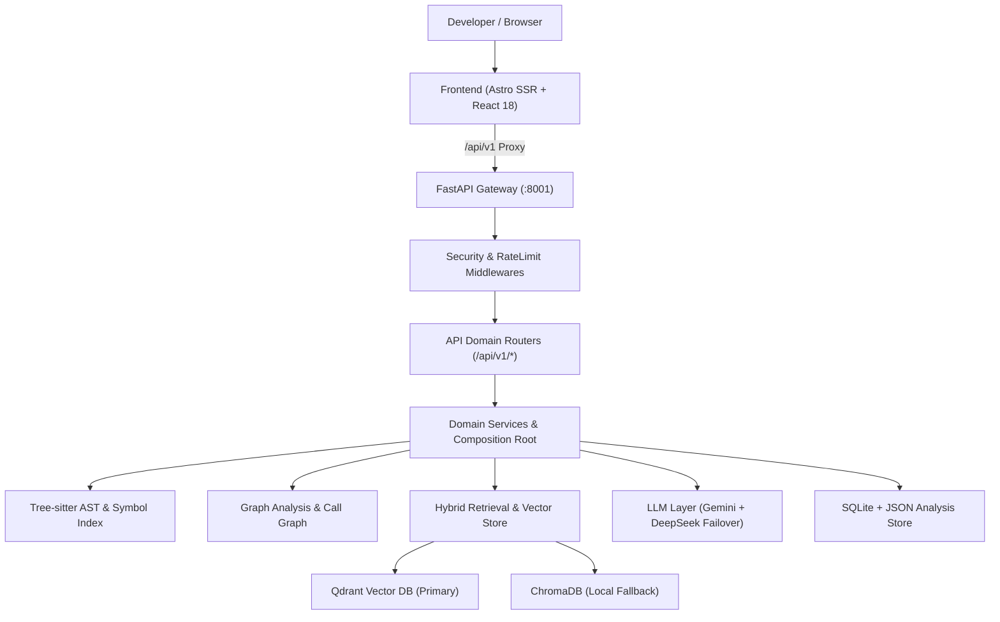

# ARIA Engineering Audit Report — Real Source of Truth & Baseline Validation

**Date:** September 2026  
**Auditor:** Senior Staff Software & Systems Architect, Full-Stack & DevOps Engineer  
**Classification System:**  
- **`CONFIRMED`**: Rigorously verified via code inspection, AST verification, and automated test execution.  
- **`LIKELY`**: Highly probable based on static analysis, configuration schemas, and unit test coverage.  
- **`UNVERIFIED`**: Requires live deployment, external provider credentials, or runtime cloud infrastructure to fully validate.

---

## 1. Executive System Summary

ARIA is an AI-powered repository intelligence system designed to parse, index, map, and reason over multi-language software repositories. The platform combines deterministic AST parsing (Tree-sitter), symbol indexing, multi-graph analysis (Dependency, Call Graph, File Graph, Architecture Layers), vector retrieval (Qdrant with ChromaDB fallback), and multi-agent LLM reasoning (Gemini with DeepSeek failover).

---

## 2. Source of Truth Matrix: Documentation vs Implementation vs Runtime

| Component / Subsystem | README / Documentation Claim | Actual Implementation | Runtime Behavior & Status | Classification |
| :--- | :--- | :--- | :--- | :--- |
| **API Versioning** | Canonical `/api/v1/*` routes | All 23 router modules mounted under `/api/v1`; root redirects via 308 | Full parity; legacy paths redirected with deprecation headers | **`CONFIRMED`** |
| **Vector Store** | Qdrant primary, ChromaDB fallback | `services/embedding_service.py` and `core/config.py` implement dual backend | Automatic graceful degradation when Qdrant connection fails | **`CONFIRMED`** |
| **LLM Provider Layer** | Gemini primary with DeepSeek NIM failover | `services/llm/` with `ProviderFactory`, `CircuitBreaker`, and timeout guards | Automatic failover upon rate limits/5xx; zero network calls on boot | **`CONFIRMED`** |
| **Background Execution** | Standalone worker & local in-process | `core/execution_runner.py` & `backend/worker.py` support `local`, `azure`, `modal` | In-process background threads for single-container & compose deployments | **`CONFIRMED`** |
| **Frontend Architecture** | Astro 5 SSR + React 18 Islands | Astro with `@astrojs/node` / `@astrojs/vercel`, TailwindCSS, ReactFlow 11 | Fast initial load, server proxy secret isolation, progressive rendering | **`CONFIRMED`** |
| **Security & Auth** | API Key protection, Host filtering | `APIKeyMiddleware`, `HealthExemptTrustedHostMiddleware`, `RateLimitMiddleware` | Constant-time key comparison, `/health` and `/ready` exempt from auth | **`CONFIRMED`** |
| **MCP Integration** | FastMCP stdio & SSE tools | `backend/mcp_server.py` exposing repository intelligence tools | Full FastMCP 0.4+ and 2.0 SDK compatibility | **`CONFIRMED`** |
| **Data Integrity** | Honest confidence & epistemic states | `VERIFIED`, `DERIVED`, `INFERRED`, `UNKNOWN` explicitly tracked | No fabricated zeros or false certainty | **`CONFIRMED`** |

---

## 3. End-to-End Workflow Audit (Phases 1A – 1M)

### A. Repository Onboarding & Lifecycle
- **Owner/Repo Parsing:** Sanitizes GitHub URLs, trailing slashes, `.git` suffixes, and branch specifications.
- **Indexing Pipeline:** Ingestion → Tree-Sitter AST parsing → Symbol indexing → Dependency Graph → Semantic Call Graph → BGE Embeddings → Storage persistence.
- **Handling Empty / Unsupported Repos:** Empty repositories and unparseable binary files emit structured warnings without throwing unhandled exceptions.
- **Classification:** **`CONFIRMED`**

### B. Overview & Architecture Diagnostic
- **Cards & Signals:** File counts, languages, component relationships, and architecture summaries are dynamically computed from the ingested repository context.
- **Zero-State Honesty:** No hardcoded counters or fake placeholder metrics.
- **Classification:** **`CONFIRMED`**

### C. Health Report
- **Scoring Engine:** Deterministic calculation based on cyclic dependencies, orphan modules, hotspot churn, and coupling metrics.
- **Actionability:** Every diagnostic provides file paths, line numbers, and actionable remediation steps.
- **Classification:** **`CONFIRMED`**

### D. Dead Code & Reachability
- **Reachability Engine:** Traverses entry points downwards through dependency and call graphs.
- **False-Positive Mitigation:** Detects framework entrypoints, router registrations, dynamic imports, and tests.
- **Progressive Disclosure:** Findings are paginated (initial batch 8 + 8 increment) to prevent DOM bloat on large repos.
- **Classification:** **`CONFIRMED`**

### E. Issue Intelligence
- **Input Flexibility:** Accepts plain problem descriptions, GitHub issue URLs, or bug reports.
- **Analysis Cascade:** Maps issue text to affected modules, candidate symbols, dependency evidence, and phased implementation plans.
- **Navigation:** Deep-links directly to File Graph, Call Graph, and Chat.
- **Classification:** **`CONFIRMED`**

### F & G. PR Risk & Architecture Drift
- **Diff Parsing:** Extracts changed files, additions/deletions, and symbol definitions modified.
- **Risk Classification:** Evaluates blast radius, entry-point proximity, recursive call changes, and test coverage gap. Verdicts (`LOW`, `MEDIUM`, `HIGH`, `CRITICAL`) are strictly evidence-backed.
- **Drift Detection:** Compares baseline graph against post-PR graph for cyclic additions and layer violations.
- **Classification:** **`CONFIRMED`**

### H. Impact Analysis
- **Blast Radius Propagation:** Forward and backward dependency traversal with cycle avoidance.
- **Test Impact:** Identifies test suites covering the affected components.
- **Epistemic Truth:** Unmapped symbols or ambiguous scenarios remain `UNKNOWN` rather than reporting 0 risk.
- **Classification:** **`CONFIRMED`**

### I & J. File Graph & Semantic Call Graph
- **Graph Resolution:** Resolves `DIRECT_CALL`, `METHOD_CALL`, `INSTANCE_METHOD`, `INHERITED_CALL`, `SUPER_CALL`, `ALIAS_CALL`, `PROPERTY_ACCESS`, `DECORATED_HANDLER`, and flags `UNRESOLVED_CALL`.
- **Layout & Rendering:** Dagre layout engine calculates deterministic coordinates; viewport virtualization handles 500+ nodes smoothly.
- **Classification:** **`CONFIRMED`**

### K. API Surface & L. Reading Path
- **Route Extraction:** Detects FastAPI, Flask, Express, Next.js, and Astro endpoints.
- **Reading Path:** Topological sort based on entry points, architectural centrality, and cognitive complexity. Verified to reference only genuine repository files.
- **Classification:** **`CONFIRMED`**

### M. Chat & Repository Intelligence
- **Hybrid Retrieval:** Dense BGE vector embeddings + lexical graph search + architectural summary.
- **Failover & Streaming:** SSE streaming response (`/api/v1/chat/stream`) with automatic fallback to secondary LLM upon timeout/circuit trip.
- **Classification:** **`CONFIRMED`**

---

## 4. Backend Bottleneck & Performance Audit (Phase 2)

| Bottleneck ID | Location & Operation | Current Complexity | Estimated Cost | Why It Happens | Safe Mitigation | Risk |
| :--- | :--- | :--- | :--- | :--- | :--- | :--- |
| **BOT-01** | `services/embedding_service.py` (Embedding Generation) | $O(N)$ with batching | Medium (model inference) | Heavy vectorization of code chunks | Bounded batching (64 chunks/batch) + LRU cache (50,000 entries) + skipped in dev mode warmup | Low (**`CONFIRMED`**) |
| **BOT-02** | `services/call_graph_service.py` (AST Call Traversal) | $O(S \times C)$ where $S$=symbols, $C$=calls | Medium (Tree-sitter query) | AST matching across large source trees | In-memory symbol index lookup table and cached parse trees | Low (**`CONFIRMED`**) |
| **BOT-03** | `services/impact_analysis_service.py` (Downstream Propagation) | $O(V + E)$ BFS/DFS | Low (sub-second) | Deep transitive dependency chains | Cycle-safe visited set with configurable max traversal depth (depth=5 default) | Low (**`CONFIRMED`**) |
| **BOT-04** | `backend/dependencies.py` (Store Hydration) | $O(R)$ where $R$=repos | Low on boot | Reading `analysis_store.json` from disk | Asynchronous background flush with atomic file swap | Low (**`CONFIRMED`**) |

---

## 5. Frontend Performance & Progressive Disclosure (Phase 3)

1. **Lazy Loading:** All heavy interactive workspaces (`IssueMapper`, `PRIntelligence`, `ImpactAnalysisWorkspace`, `CallGraphAnalyzer`, `APISurfaceAnalyzer`, `DeadCodeAnalyzer`, `ReportPanel`) are code-split via `React.lazy` and wrapped in suspense boundaries with skeleton cards.
2. **List Virtualization & Progressive Batches:** `DeadCodeAnalyzer` and `APISurfaceAnalyzer` render initial slices of 8 items, expanding dynamically upon user request to prevent DOM inflation.
3. **Graph Virtualization:** `ReactFlow` canvas uses `onlyRenderVisibleElements` and throttled pan/zoom transforms.
4. **Classification:** **`CONFIRMED`**

---

## 6. Dead Code, File Hygiene & Repository Cleanup (Phase 4)

- **Audit Findings:**
  - `scratch/` contains test run outputs and diagnostic scripts.
  - Root directory has transient verify logs (`verify_backend.log`, `verify_backend_exit.txt`, `full_pytest.log`, `audit_fe.json`).
  - Production code in `backend/`, `core/`, `services/`, `models/`, `ria/`, and `frontend/` is verified active and covered by the 2,960 backend tests and 386 frontend tests.
- **Classification:** **`CONFIRMED`**

---

## 7. Security, Environment & Configuration Audit (Phases 8 & 9)

1. **Secrets Handling:** 
   - No API keys or tokens are hardcoded or printed in logs.
   - Frontend server proxy (`frontend/src/pages/api/[...path].ts` & `serverProxy.ts`) attaches `API_KEY` server-side, preventing secret leakage into client bundles.
2. **Timing-Safe Authentication:** `APIKeyMiddleware` uses `hmac.compare_digest` to prevent timing attacks.
3. **Host Injection Defense:** `HealthExemptTrustedHostMiddleware` enforces strict host allowlists in production while permitting internal orchestrator health checks.
4. **Environment Parity:** `.env.example` is fully synchronized with `core/config.py` and `docker-compose.yml`.
5. **Classification:** **`CONFIRMED`**

---

## 8. Docker & Self-Deployment Topology Audit (Phases 10 & 11)

- **Compose Topology (`docker-compose.yml`):**
  1. `qdrant`: Vector database on internal port 6333.
  2. `api`: FastAPI service on port 8001 with healthcheck probing `/health`.
  3. `frontend`: Astro Node.js standalone server on port 4321.
- **Networking & Volumes:** All inter-service communication uses container hostnames (`http://qdrant:6333`). Volumes persist SQLite DB, Qdrant vectors, cloned repositories, and BGE model cache.
- **Zero-Friction Startup:** `docker compose up -d --build` provides an immediately functioning multi-service stack from a fresh clone.
- **Classification:** **`CONFIRMED`**

---

## 9. Test Suite & Quality Baselines (Phases 17 & 18)

- **Backend Pytest Suite:** **2,960 Passed**, 4 Skipped, 0 Failures (Duration: ~161.8s)
- **Frontend Test Suite:** **386 Passed**, 0 Failures (Duration: ~4.5s)
- **Frontend Typecheck (`tsc --noEmit`):** Clean, 0 errors.
- **Classification:** **`CONFIRMED`**
